## Table of Contents
- [1. Introduction](#1-introduction)
- [2. Setting Up](#2-setting-up)
- [3. Design](#3-design)
    * [3.1. Architecture](#31-architecture)
    * [3.2. Components](#32-components)
        * [3.2.1 UI Component](#321-ui-component)
        * [3.2.2 Logic Component](#322-logic-component)
        * [3.2.3 Model Component](#323-model-component)
        * [3.2.4 State Component](#324-state-component)
        * [3.2.5 Storage Component](#325-storage-component)
    * [3.3. Commons Classes](#33-commons-classes)
- [4. Implementation](#4-implementation)
    * [4.1. State](#41-state)
    * [4.2. Parsers](#42-parsers)
        * [4.2.1. Page Parsers](#421-page-parsers)
        * [4.2.2. Command Parsers](#422-command-parsers)
        * [4.2.3. Interaction Between Parsers](#423-interaction-between-parsers)
    * [4.3. Commands](#43-commands)
        * [4.3.1. Add Commands](#431-add-commands)
            * [4.3.1.1. Create Budget](#4311-create-budget)
            * [4.3.1.2. Add Expenditure](#4312-add-expenditure)
        * [4.3.2. Delete Commands](#432-delete-commands)
            * [4.3.2.1. Delete Budget](#4321-delete-budget)
            * [4.3.2.2. Delete Expenditure](#4322-delete-expenditure)
        * [4.3.3. Edit Commands](#433-edit-commands)
            * [4.3.3.1. Edit Budget](#4331-edit-budget)
            * [4.3.3.2. Edit Expenditure](#4332-edit-expenditure)
        * [4.3.4. Sort Commands](#434-sort-commands)
        * [4.3.5. Find & List Commands](#435-find--list-commands)
        * [4.3.6. Undo & Redo Commands](#436-undo--redo-commands)
        * [4.3.7. Universal Commands](#437-universal-commands)
            * [4.3.7.1 Help](#4371-help)
    * [4.4. UI](#44-ui)
        * [4.4.1. List View Rendering](#441-list-view-rendering)
        * [4.4.2. Dynamic Updating](#442-dynamic-updating)
            * [4.4.2.1. Description](#4421-description)
            * [4.4.2.2. Implementation](#4422-implementation)
    * [5. Guides](#5-guides)
        * [5.1. Documentation](#51-documentation)
        * [5.2. Testing](#52-testing)
        * [5.3. Logging](#53-logging)
        * [5.4. Configuration](#54-configuration)
        * [5.5. DevOps](#55-devops)
    * [Appendix](#appendix)
        * [Product Scope](#product-scope)
        * [User Stories](#user-stories)
        * [Use Cases](#use-cases)
        * [Non-Functional Requirements](#non-functional-requirements)
        * [Glossary](#glossary)
        * [Instructions for Manual Testing](#instructions-for-manual-testing)
        * [Effort](#effort)

## 1. Introduction

### Overview
NUSave is a budgeting tool made for **university students staying on campus** who want to be able to track and manage 
their own expenditures with ease. As students, it is common for them to have limited income during their academic years.
Therefore, it is especially necessary for those living independently to plan their finances prudently to ensure that
they do not overspend their tight budget.

A typical student staying on campus has to keep track of: 
* daily expenses
* club finances
* project budgets
* administrative fees

Rather than having multiple documents and spreadsheets to keep track of their budgets, NUSave allows students to
conveniently manage all their expenditures under one centralised platform.

NUSave implements both **Command Line Interface (CLI)** and **Graphical User Interface (GUI)**.
In other words, users interact with the application through the command line and the GUI will reflect their actions.

### Purpose
This document acts as a guide for developers, testers, and designers describing both the architecture and design 
of NUSave.

## 2. Setting Up
(Contributed by Yu Ming)

Refer to the guide [_Setting up and getting started_](SettingUp.md).

## 3. Design

(Contributed by Song Yu)

This section elaborates on the higher-level components that work together within NUSave. 

### 3.1. Architecture

(Contributed by Chin Hui)

This section explains the high-level design of the application.

Figure 3.1.1. Figure of Architecture Diagram

Figure 3.1.1. shows the how each high-level component in NUSave is related to each other.

Given below is a quick overview of each component:

**`Main`** has two classes called [`Main`] and [`MainApp`].
It has two primary responsibilities:
* At launch: Initializes the components in the correct sequence, and connects them up with each other.
* At shut down: Shuts down the components and invokes cleanup methods where necessary.

[**`Commons`**](#common-classes) represents a collection of classes used by multiple other components.

The rest of the application consists of five components:

1. [**`UI`**](#321-ui-component): Handles the UI of the application.
1. [**`Logic`**](#322-logic-component): Executes the commands.
1. [**`Model`**](#323-model-component): Holds the data of the application in memory.
1. [**`Storage`**](#324-storage-component): Reads data from, and writes data to, the hard disk.
1. [**`State`**](#325-state-componenet): Remembers the current state of the application.

For each of the five components:

* Its API is defined in an `interface` with the same name as the Component.
* Its functionality is exposed using a concrete `{Component Name} Manager` class which implements the corresponding API
`interface` mentioned in the previous point.
    - For example, the `Logic` component defines its API in the `Logic.java` interface and exposes its functionality
    using the `LogicManager.java` class which implements the `Logic` interface.

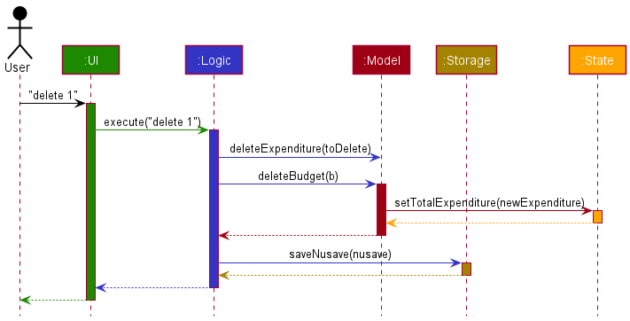

Figure 3.1.2. Figure of Architecture Sequence Diagram

Figure 3.1.2. shows how the components interact with each other for the scenario where the user
issues the command `delete 1` in a budget page.

The sections below give more details of each component:

### 3.2. Components

This section elaborates on the different high-level components in NUSave.

#### 3.2.1. UI Component

(Contributed by Song Yu)

**API**: `Ui.java`

The UI consists of a `MainWindow` that is made up of parts e.g.`CommandBox`, `ResultDisplay`,
`StatusBarFooter` etc. All these, including the `MainWindow`, inherit from the abstract `UiPart` class.

The `UI` component uses JavaFx UI framework. The layout of these UI parts are defined in matching `.fxml` files that are in the `src/main/resources/view` folder. For example, the layout of the `MainWindow` is specified in `MainWindow.fxml`.

In order to dynamically render data to be displayed to the user, when `setUpGuiComponents()` in `MainWindow` is called, 
the method `setStateBinders()` sets Observer objects to observe changes in `State`. For a complete explanation,
refer to [4.4.2. Dynamic Updating](#442-dynamic-updating).

In summary, the `UI` component:

* Executes user commands using the `Logic` component.
* Listens for changes to `Model` and `State` data so that the UI can be updated with the modified data.

#### 3.2.2. Logic Component
(Contributed by Yu Ming)

**API**: `Logic.java`

`Logic` uses the `MainPageParser` and `BudgetPageParser` class to parse the user command. This results in a
`Command` object which is executed by the `LogicManager`. The command execution can affect the `Model`
(e.g. adding an expenditure). The result of the command execution is encapsulated as a `CommandResult` object
which is passed back to the `Ui`. In addition, the `CommandResult` object can also instruct the `Ui` to perform
certain actions, such as displaying help to the user.

`MainPageParser`:
- Parse all the commands that is inputted by the user when the state of the NUSave is on `MAIN`.
- This includes commands such as `CreateBudgetCommand` and `OpenBudgetCommand` that are unique to execute at the MainPage.

`BudgetPageParser`:
- Parse all the commands that is inputted by the user when the state of the NUSave is on `BUDGET`.
- This includes commands such as `AddExpendtureCommand` and `CloseBudgetCommand` that are unique to execute at the BudgetPage.

`Commands`:
-  The `Logic` component includes all commands that is executable on both Main Page and Budget Page. For a complete
elaboration on what each command does, refer to [4.3. Commands](#43-commands).

Figure 3.2.2.1. Figure of Sequence Diagram for `delete 1`

Figure 3.2.2.1. above represents the interactions within the `Logic` component for the
`execute("delete 1")` call to remove a budget in NUSave.

#### 3.2.3. Model Component
(Contributed by Chin Hui)

Figure 3.4.1: Structure of the model component.

**API** : `Model.java`

The `Model`:

* Stores a `UserPref` object that represents the user’s preferences.
* Stores a `Nusave` object that encapsulates `Budget` and `Expenditure` data.
* Exposes an unmodifiable `FilteredList<Renderable>` 
that can be 'observed' e.g. the UI can be bound to this list so
that the UI automatically updates when the data in the list change.
* Does not depend on any of the other three components.
* `FilteredList` was used in favor of `ObservableList` to facilitate the find command implementation.
Now the list can be filtered based on a `Predicate`, allowing for more flexibility for other 
filtering extensions i.e. filter by number of expenditures.

The `Nusave`:

* Implements methods that interface with the `Budget` and `Expenditure` 
data following the "Tell, Don't Ask" Principle.
* Stores an `ObservableList<Renderable>` that is passed up to populate the `FilteredList<Renderable>`.
* Stores a `BudgetList` (wrapper class for a `List<Budget>`) as well to access `Expenditures` within a `Budget` since
`Expenditures` cannot be accessed through `ObservableList<Renderable>`.

The `Budget`:
* Implements the Renderable interface and can thus be stored in the FilteredList.
* Contains a `Name`, `Date`, `Optional<Threshold>` and a `List<Expenditure>`.

The `Expenditure`:
* Implements the Renderable interface and can thus be stored in the FilteredList.
* Contains a `Name`, `Date`, `Price` and `Set<Tag>`.

#### 3.2.4. State Component
 (Contributed by Song Yu)
 
 **API**: `State.java`
 
  
  
  Figure 3.5.1: Structure of the state component.
  
 The `State` component:
 * Represents the current page view NUSave is currently on. Specifically, it represents whether the user is looking at 
 the main page view or budget page view. The current view is represented by an attribute in `StateManager`, `currentPage`.
 * Stores data related to the current state of NUSave. This refers to data such as the current page NUSave is currently on,
 or the current budget that it is accessing.
 
 `State`  lives inside `Model`, where `Model` will use `State` to store stateful data, where these data will be used to 
 update information displayed on the GUI, such as the current expenditure of the accessed budget, or list of expenditures 
 belonging to the accessed budget.
 
#### 3.2.5. Storage Component
(Contributed by Wen Hao)

**API** : `Storage.java`

The `Storage` component:
* Can save `UserPref` objects in JSON format and read it back.
* Can save all NUSave data in JSON format and read it back.

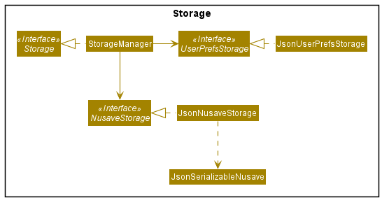

Figure 3.6.1: Structure of the storage component.

The `Storage` component uses the Jackson API to convert Plain Old Java Objects (POJOs) into JSON files which are then
stored locally. It uses the same API to read existing JSON files during the launch of the application to load the stored
data into `NUSave`. As seen in Figure 3.6.1, `JsonUserPrefsStorage` is responsible for the reading and writing of
`UserPref` objects and contains the file path of its JSON file while `JsonNusaveStorage` is responsible for the
reading and writing of all NUSave data and contains the file path of its JSON file.

Figure 3.6.2: Structure of the data stored by NUSave.

In order for them to be recognised by the Jackson API, NUSave data objects (such as `Budget` and `Expenditure`) must be
converted into POJOs. Figure 3.6.2 depicts how the respective POJO classes for each of the data objects interact with
one another.

### 3.3. Commons Classes
Classes used by multiple components are in the `seedu.addressbook.commons` package.

## 4. Implementation

(Contributed by Song Yu)

This section elaborates on the implementations of various commands and components in NUSave.

### 4.1. State

(Contributed by Song Yu)

This section provides context on how `State` affects how commands are parsed by parsers in NUSave.

`State` stores what page NUSave is currently on. If NUSave is on the main page view, `State` stores an attribute of
`Page.MAIN`, and stores an attribute of `Page.BUDGET` if NUSave is on a budget page view.

The `Logic` component in NUSave relies on this data stored in `State` to decide which parser in NUSave will take
control of the execution of commands.

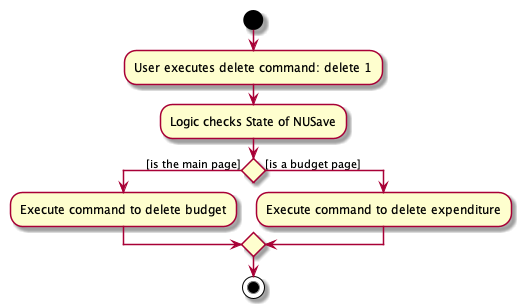

Figure 4.1.1. Delete Command Activity Diagram

To elaborate further, using Figure 4.1.1. as a reference, when the user executes a delete command, `delete 1`,
while on the main page:

1. `Logic` executes the command, checking whether the current page is a budget page or main page, depending on the 
current page (represented by `currentPage` attribute in `StateManager`) of NUSave.
2. Since NUSave is currently on `Page.MAIN`, `MainPageParser` takes control of the execution, parsing the command input by the user.
3. If the command syntax is valid, the delete command is parsed.

    3a. If the syntax is invalid, a `ParseException` is thrown.

4. NUSave deletes the budget based on the index specified by the user, i.e. the 1st budget displayed.

### 4.2. Parsers

(Contributed by Wen Hao)

This section describes the details surrounding the parsers which are responsible for converting user inputs into `Command` objects.

All user inputs are parsed by two types of parsers:
1. Page Parsers
2. Command Parsers

These parsers are part of the `Logic` component as seen from the class diagram in Figure 4.2.1 below:

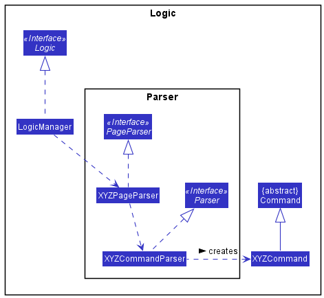

Figure 4.2.1. Class diagram of parsers

**Design Considerations**

* Option A: Use a single parser to parse both main and budget page commands
   * Pros: Less code to write
   * Cons: Parser class will messy as it needs to differentiate between main and budget page commands that use the same command word.

* **Option B (Chosen):** Use page parsers to parse commands that are available on a page
   * Pros: Code is more organised and readable
   * Cons: More code to write

#### 4.2.1. Page Parsers

(Contributed by Wen Hao)

Page parsers are responsible for determining the type of `Command` object that will be generated from a user input.
They enable NUSave to only recognise a set of commands specific to a certain `Page` when the user is on that `Page`.

They implement the `PageParser` interface.

All user inputs are first parsed by a page parser.
It identifies the first word to be the command word and uses it to determine the type of `Command` object that will be generated.
The remaining words are then passed as arguments to the respective command parsers.
A `ParseException` is thrown if the command word is not recognised by the page parser.

There are two types of page parsers:
1. `MainPageParser`
2. `BudgetPageParser`

User inputs are parsed by the `MainPageParser` if they are entered while NUSave is on the main page.
User inputs are parsed by the `BudgetPageParser` if they are entered while NUSave is on a budget page.

More information regarding what page the user is on can be found [here](#41-state).

#### 4.2.2. Command Parsers

(Contributed by Wen Hao)

Command parsers are responsible for generating the different types of `Command` object.

They implement the `Parser<T>` interface.

Arguments in user inputs are parsed by a command parser to generate the respective `Command` object.
The type of `Command` object generated by a command parser follows the generic type of the `Parser<T>` it implements.
For example, `AddExpenditureCommandParser` implements the `Parser<AddExpenditureCommand>` interface. Hence, it will only generate `AddExpenditureCommand` objects.
A `ParseException` is thrown if the necessary arguments to generate the respective `Command` object are invalid or missing.

#### 4.2.3. Interaction Between Parsers

(Contributed by Wen Hao)

The interaction between the parsers is illustrated by the example usage seen in Figure 4.2.3.1 below:

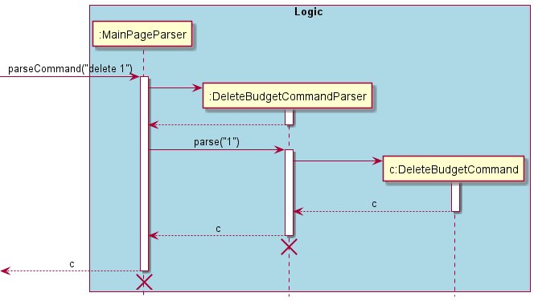 

Figure 4.2.3.1. Sequence diagram of a user input being parsed.

### 4.3. Commands

(Contributed by Song Yu)

This section elaborates on the implementations of the commands available in NUSave.

#### 4.3.1. Add Commands

This section describes the details surrounding events at which users would wish to add information into NUSave. 
Specifically, when a user wishes to create a new budget to the Main Page, or when a user wishes to add an expenditure
to a budget.

##### 4.3.1.1. Create Budget

(Contributed by Yu Ming)

This section explains the `Create Budget Command`.

The following activity diagram to shows the events that occur when the user executes the Create Budget Command.

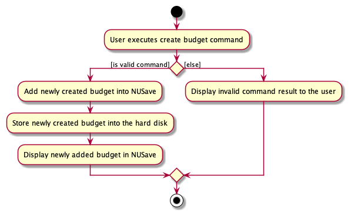 

Figure 4.3.1.1: Activity diagram for create budget command.

The following command occurs in the `Main Page` of NUSave, and results in the specified budget being created in
NUSave. This command therefore requires a compulsory name to specify the name of the budget to be created.

The following Sequence Diagram shows the interaction between the `Logic` component and `Model` component of NUSave 
depicting a scenario when the user wants to create a budget for his Temasek Hall basketball CCA by entering the command
`create n/Temasek Hall Basketball p/100`.

 

Figure 4.3.1.2: Sequence diagram for create budget command in main page view.
>Lifelines with a destroy marker (X) should end at the destroy marker (X) but due to a limitation of PlantUML, 
the lifeline reaches the end of diagram.

1. The `LogicManager` uses the `MainPageParser` to parse the given user input.
2. The `MainPageParser` will identify the command given by the user and pass the user input down to the
`CreateBudgetCommandParser`.
3. The `CreateBudgetCommandParser` will create a `Budget` with the given parameters **name** and **threshold** from the
user input.
4. The `CreateBudgetCommandParser` will then create a `CreateBudgetCommand` object with the created `Budget` object as
the input parameter.
5. The `CreateBudgetCommandParser` will then return a `CreateBudgetCommand` object.
6. `LogicManager` will now call the `execute` method in the `CreateBudgetCommand` object.
7. The `CreateBudgetCommand` will now call the `addBudget` method of the existing `Model` object and add the `Budget`
object created into NUSave.
8. The `CreateBudgetCommand` then returns a `CommandResult` indicating the successful addition of the `Budget` object.

With the above sequence, a budget will be successfully created by the user in his NUSave application, and it will be
reflected on the user interface.

##### 4.3.1.2. Add Expenditure

(Contributed by David)

This section explains the `Add Expenditure Command`.

The following activity diagram to shows the events that occur when the user executes the `Add Expenditure Command`.

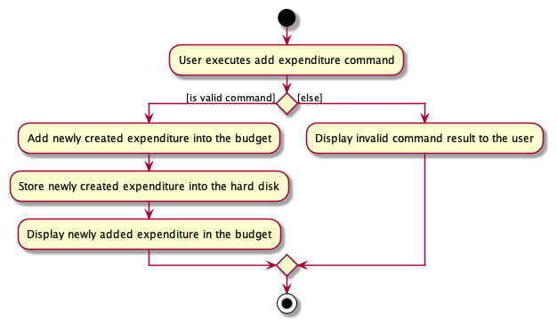 

Figure 4.3.1.2.1: Activity Diagram for add expenditure command.

Similar to creating a Budget, the add expenditure Command also shows the interaction between the `Logic` component 
and `Model` component of NUSave. The sequence diagram depicts a scenario when the user wants to add an expenditure for 
his budget by entering the command `add n/Basketball p/20 t/Ball`.

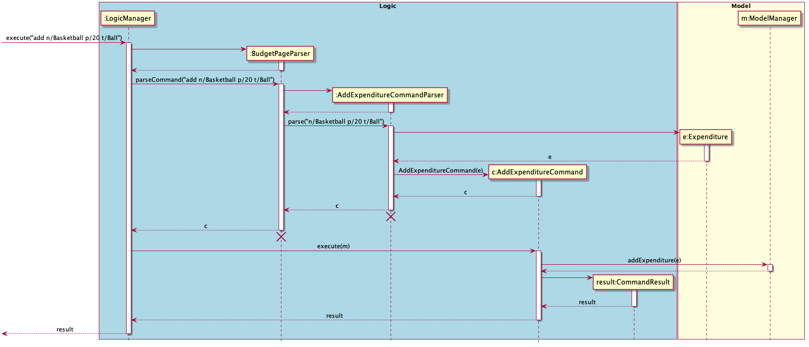 

Figure 4.3.1.2.2: Sequence diagram for add expenditure command in budget page view.

1. Beginning with the `LogicManager`, the `LogicManager` hands the given user input to the `BudgetPageParser` 
to be parsed.
2. The `BudgetPageParser` will identify the command given by the user and pass the user input down to the
`AddExpenditureCommandParser` to be parsed.
3. The `AddExpenditureCommandParser` will create an `Expenditure` with the given parameters **name**, **price** and
optionally **tags** from the user input.
4. The `AddExpenditureCommandParser` will then create an `AddExpenditureCommand` object with the created `Budget` 
object as the input parameter.
5. The `AddExpenditureCommandParser` will then return an `AddExpenditureCommand` object.
6. `LogicManager` will now call the `execute` method in the `AddExpenditureCommand` object.
7. The `AddExpenditureCommand` will now call the `addExpenditure` method of the existing `Model` object and add the 
`Expenditure` object created into NUSave.
8. The `AddExpenditureCommand` then returns a `CommandResult` indicating the successful addition of the `Expenditure`
object.

With the above sequence, an expenditure will be successfully created by the user in his NUSave application under 
the specific budget, and will be immediately reflected on the user interface.

#### 4.3.2. Delete Commands

(Contributed by David)

This section describes the details surrounding events at which users would wish to delete information from NUSave. 
Specifically, deletion can happen in two areas; when a user wishes to delete a budget from the Main Page, or when a 
user wishes to delete an expenditure from a budget.

##### 4.3.2.1. Delete Budget

(Contributed by David)

This section explains the `Delete Budget Command`.

The following activity diagram to shows the events that occur when the user executes the `Delete Budget Command`.

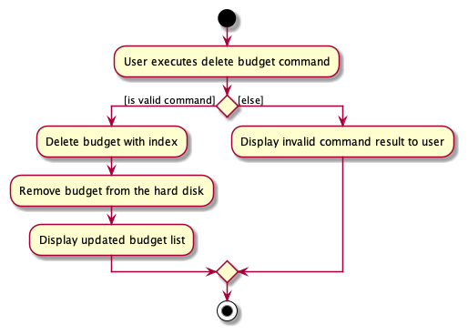 

Figure 4.3.2.1.1: Activity Diagram for delete budget command.

The following command occurs in the `Main Page` of NUSave, and results in the specified budget of the particular index 
to be removed from NUSave. This command therefore requires a compulsory index to specify the particular budget to be 
removed.

Only when the index given by the user is valid (within the range of existing budgets), does the command execute 
successfully.

The following sequence diagram shows the interactions between the `Logic` and `Model` components of NUSave,
depicting a scenario where the user would like to delete the first budget on his list.

 

Figure 4.3.2.1.2: Sequence diagram  for delete budget command in main page view.

1. The `LogicManager` uses the `MainPageParser` to parse the given user input.
2. The `MainPageParser` will identify the command given by the user and pass the user input down to the
`DeleteBudgetCommandParser`.
3. The `DeleteBudgetCommandParser` will create a `BudgetIndex` with the given parameters **index**  from the
user input.
4. The `DeleteBudgetCommandParser` will then create a `DeleteBudgetCommand` object with the created `BudgetIndex`
object as the input parameter.
5. The `DeleteBudgetCommandParser` will then return a `DeleteBudgetCommand` object back to the `LogicManager`.
6. `LogicManager` will now call the `execute` method in the `DeleteBudgetCommand` object, with the `Model` as a 
parameter.
7. The `DeleteBudgetCommand`'s `execute` method will now call the `deleteBudget` method of the existing `Model` object
passed in and delete the `Budget` object within NUSave.
8. The `DeleteBudgetCommand` then returns a `CommandResult` indicating the successful deletion of the `Budget` object.

With the above sequence, a budget will be successfully deleted by the user in his NUSave application, and it will be
reflected on the user interface through the successful `CommandResult` and updated budget list.

##### 4.3.2.2. Delete Expenditure

(Contributed by David)

This section explains the `Delete Expenditure Command`.

The following activity diagram to shows the events that occur when the user executes the `Delete Expenditure Command`.

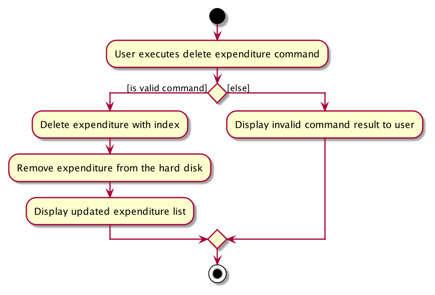 

Figure 4.3.2.2.1: Activity Diagram for delete expenditure command.

The following command occurs in the `Budget Page` of NUSave, and results in the specified expenditure of the particular 
index to be removed from NUSave. This command therefore requires a compulsory index to specify the particular 
expenditure to be removed.

Only when the index given by the user is valid (within the range of existing budgets), does the command execute 
successfully.

The following sequence diagram is similar to `figure 4.3.2.1.1` which shows the interactions between the `Logic` and 
`Model` components of NUSave, depicting a scenario where the user within a budget would like to delete the first 
expenditure on his list.

Figure 4.3.2.2.2: Sequence diagram  for delete budget command in budget page view.

1. The `LogicManager` uses the `BudgetPageParser` to parse the given user input.
2. The `BudgetPageParser` will identify the command given by the user and create a `DeleteBudgetCommandParser`.
3. The `BudgetPageParser` will pass the user input into the newly created`DeleteBudgetCommandParser`.
3. The `DeleteExpenditureCommandParser` will create a `ExpenditureIndex` with the given parameters **index**  from the
user input.
4. The `DeleteExpenditureCommandParser` will then create a `DeleteExpenditureCommand` object with the created 
`ExpenditureIndex` object as the input parameter.
5. The `DeleteExpenditureCommandParser` will then return the `DeleteExpenditureCommand` object back to the 
`LogicManager`.
6. `LogicManager` will now call the `execute` method in the `DeleteExpenditureCommand` object, with the `Model` as a 
parameter.
7. The `DeleteExpenditureCommand`'s `execute` method will now call the `deleteExpenditure` method of the existing 
`Model` object passed in and delete the `Expenditure` object within NUSave.
8. The `DeleteExpenditureCommand` then returns a `CommandResult` indicating the successful deletion of the 
`Expenditure` object.

With the above sequence, a budget will be successfully deleted by the user in his NUSave application, and it will be
reflected on the user interface through the successful `CommandResult` and updated budget list.

#### 4.3.3. Edit Commands

(Contributed by David)

This section describes the details surrounding events at which users would wish to edit information from NUSave. 
Specifically, editing can happen in two areas; when a user wishes to edit a budget from the `Main Page`, or when a 
user wishes to edit an expenditure from a budget within the `Budget Page`.

##### 4.3.3.1. Edit Budget

(Contributed by Yu Ming)

This section explains the `Edit Budget Command`.

The following activity diagram to shows the events that occur when the user executes the Edit Budget Command.

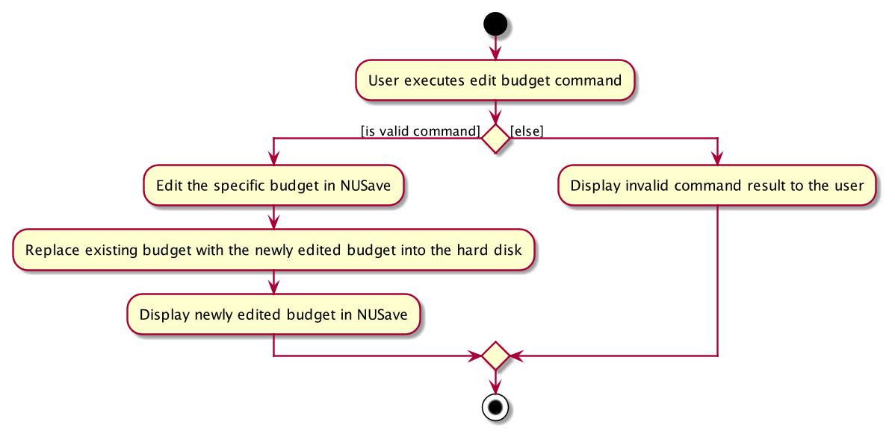 

Figure 4.3.3.1.1: Activity diagram for edit budget command.

The following command occurs in the `Main Page` of NUSave, and  results in the specified budget of the particular index 
to be edited within NUSave. As such, this command requires a compulsory index to specify the particular budget, 
along with fields at which the user would like to edit.

Only when the index is valid (within the range of existing budgets), and the user provides at least one field to 
be edited, does the command execute successfully.

The following sequence diagram shows the interactions between the `Logic` and `Model` components of NUSave,
depicting a scenario where the user would like to edit the first budget on his/her list, and change the `NAME` and
`THRESHOLD` of the budget to `Temasek Hall Basketball` and `1000` accordingly.

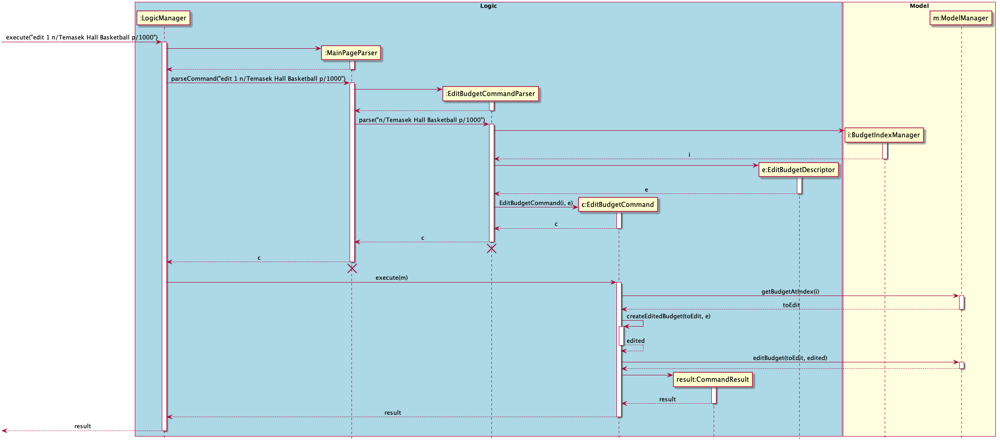

Figure 4.3.3.1.2: Sequence diagram for edit budget command in main page view.
>Lifelines with a destroy marker (X) should end at the destroy marker (X) but due to a limitation of PlantUML, 
the lifeline reaches the end of diagram.

1. Beginning with the `LogicManager`, the `LogicManager` hands the given user input to the `MainPageParser` 
to be parsed.
2. The `MainPageParser` will identify the command given by the user and create an `EditBudgetCommandParser`.
3. The `MainPageParser` will pass the user input into the newly created `EditBudgetCommandParser`.
4. The `EditBudgetCommandParser` will create an `BudgetIndex` with the given parameters `index` from the
user input.
5. The `EditBudgetCommandParser` will then create an `EditBudgetDescriptor` with the given parameters of 
`name` and `threshold`.
6. The `EditBudgetCommandParser` will then create an `EditBugetCommand` with the `BudgetIndex` and 
`EditBudgetDescriptor`.
7. The `EditBudgetCommandParser` will then return the `EditBudgetCommand` object back to the `LogicManager`.
8. `LogicManager` will now call the `execute` method in the `EditBudgetCommand` object, with the `Model` as a 
parameter.
7. The `EditBudgetCommand`'s `execute` method will now call the `editBudget` method of the existing 
`Model` object passed in and update the `Budget` with a new edited `Budget` object within NUSave.
8. The `EditBudgetCommand` then returns a `CommandResult` indicating the successful editing of the 
`Budget`.

With the above sequence, a budget will be successfully edited by the user in his NUSave application, and it will 
be reflected on the user interface through the successful `CommandResult` and updated budget list.

##### 4.3.3.2. Edit Expenditure

(Contributed by David)

This section explains the `Edit Expenditure Command`.

The following activity diagram to shows the events that occur when the user executes the `Edit Expenditure Command`.

 

Figure 4.3.2.2.1: Activity Diagram for edit expenditure command.

The following command results in the specified expenditure of the particular index to be edited within the 
`Budget Page`. As such, this command requires a compulsory index to specify the particular expenditure, along with a
field at which the user would like to edit (`NAME`, `PRICE`, `TAG`).

Only when the index is valid (within the range of existing expenditures), and the user provides at least one field to 
be edited, does the command execute successfully.

The following sequence diagram shows the interactions between the `Logic` and `Model` components of NUSave,
depicting a scenario where the user would like to edit the first expenditure on his/her list, and change the previous 
`NAME`, `PRICE` and `TAG` to `Basketball`, `50` and `Ball` accordingly.

Figure 4.3.3.2.1: Sequence diagram  for delete edit command in budget page view.

1. Beginning with the `LogicManager`, the `LogicManager` hands the given user input to the `BudgetPageParser` 
to be parsed.
2. The `BudgetPageParser` will identify the command given by the user and create an `EditExpenditureCommandParser`.
3. The `BudgetPageParser` will pass the user input into the newly created `EditExpenditureCommandParser`.
4. The `EditExpenditureCommandParser` will create an `ExpenditureIndex` with the given parameters **index**  from the
user input.
5. The `EditExpenditureCommandParser` will then create an `EditExpenditureDescriptor` with the given parameters of 
**name**, **price** and **tags**.
6. The `EditExpenditureCommandParser` will then create an `EditExpenditureCommand` with the `Expenditure Index` and 
`EditExpenditureDescriptor`.
7. The `EditExpenditureCommandParser` will then return the `EditExpenditureCommand` object back to the `LogicManager`.
8. `LogicManager` will now call the `execute` method in the `EditExpenditureCommand` object, with the `Model` as a 
parameter.
7. The `EditExpenditureCommand`'s `execute` method will now call the `editExpenditure` method of the existing 
`Model` object passed in and update the `Expenditure` with a new `Expenditure` object within NUSave.
8. The `EditExpenditureCommand` then returns a `CommandResult` indicating the successful editing of the 
`Expenditure`.

With the above sequence, an expenditure will be successfully edited by the user in his NUSave application, and it will 
be reflected on the user interface through the successful `CommandResult` and updated budget list.

#### 4.3.4. Sort Commands

(Contributed by Yu Ming)

This section explains the `Sort Command`.

The following activity diagram to shows the events that occur when the user executes the Sort Budget Command.

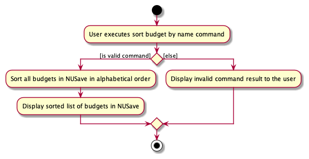 

Figure 4.3.4.1: Activity diagram for sort budget command.

The following command can occur either in the `Main Page` or `Budget Page` of NUSave, and results in either the budgets
or the expenditures to be sorted by name or created date. As such, this command requires a compulsory `SortType` field
to specify the particular type of sorting required.

Only when the `SortType` is valid (`NAME` or `TIME`) does the command execute successfully.

The following sequence diagram shows the interactions between the `Logic` and `Model` components of NUSave,
depicting a scenario where the user would like to sort the budgets by thier name in alphabetical order. 

Figure 4.3.4.2: Sequence diagram for sort budget command in main page view.

>Lifelines with a destroy marker (X) should end at the destroy marker (X) but due to a limitation of PlantUML, 
the lifeline reaches the end of diagram.

1. Beginning with the `LogicManager`, the `LogicManager` hands the given user input to the `MainPageParser` 
to be parsed.
2. The `MainPageParser` will identify the command given by the user and create an `SortBudgetCommandParser`.
3. The `MainPageParser` will pass the user input into the newly created `SortBudgetCommandParser`.
4. The `SortBudgetCommandParser` will then create an `SortBugetCommand` with the sort type `NAME`
5. The `SortBudgetCommandParser` will then return the `SortBudgetCommand` object back to the `LogicManager`.
6. `LogicManager` will now call the `execute` method in the `SortBudgetCommand` object, with the `Model` as a 
parameter.
7. The `SortBudgetCommand`'s `execute` method will now call the `sortBudgetsByName` method of the existing 
`Model` and this will sort the list of budgets in NUSave according with the given sort type `NAME`.
8. The `SortBudgetCommand` then returns a `CommandResult` indicating the successful sorting of the 
`Budget` in NUSave by their name in alphabetical oredr.

With the above sequence, budgets will be successfully sorted by the user in his NUSave application by name in
alphabetical order, and it will be reflected on the user interface through the successful `CommandResult`
and updated budget list.

Note that the `sort` command can be executed on `Budget Page` view as well to sort the list of expenditures of a given
budget. The following sequence diagram shows the interactions between the `Logic` and `Model` components of NUSave,
depicting a scenario where the user would like to sort the expenditures by their created date with the lastest created
expenditure at the top of list of expenditures.

Figure 4.3.4.3: Sequence diagram for sort expenditure command in main page view.
>Lifelines with a destroy marker (X) should end at the destroy marker (X) but due to a limitation of PlantUML, 
the lifeline reaches the end of diagram.

The details of the flow of `SortExpenditureCommand` will not be elaborate in details as it is similiar to
`SortBudgetCommand`.

#### 4.3.5. Find & List Commands

##### 4.3.5.1 List Budget

(Contributed by Chin Hui)
The following sequence diagram shows the interactions between the `Logic` and `Model` components of NUSave,
depicting a scenario where the user would like to list all budgets.

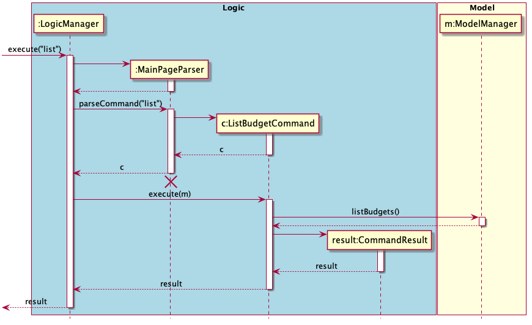

Figure 4.3.5.1.1: Sequence diagram for list budget command in main page view.

1. The `LogicManager` uses the `MainPageParser` to parse the give user input.
2. The `MainPageParser` will identify the command given by the user and create a `ListBudgetCommand`.
3. The `MainPageParser` will then return the `ListBudgetCommand` object back to the `LogicManager`.
4. `LogicManager` will now call the `execute` method in the `ListBudgetCommand` object.
5. The `ListBudgetCommand` `execute` method will now call the `listBudgets` method of the existing `Model` object and
list all existing budgets within NUSave.
6. The `ListBudgetCommand` then returns a `CommandResult` indicating the successful listing of all budgets.

With the above sequence, all budgets will be listed by the user in his NUSave application, and it will be reflected
on the user interface.

##### 4.3.5.2 Find Budget
(Contributed by Chin Hui)
The following sequence diagram shows the interactions between the `Logic` and `Model` components of NUSave,
depicting a scenario where the user would like to find budgets by a search term/phrase.

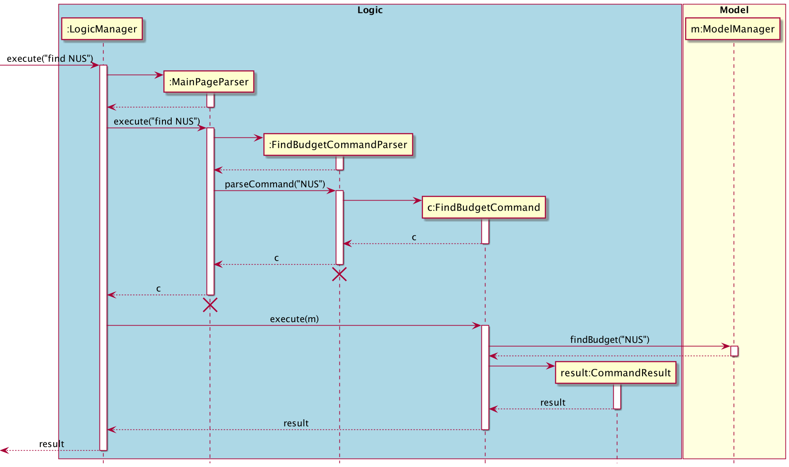

Figure 4.3.5.2.1: Sequence diagram for find budget command in main page view.

1. The `LogicManager` uses the `MainPageParser` to parse the give user input.
2. The `MainPageParser` will identify the command given by the user and pass the user input down to the 
`FindBudgetCommandParser`.
3. The `FindBudgetCommandParser` will then create a `FindBudgetCommand` with the user input as the search term.
4. `FindBudgetCommandParser` then returns the `FindBudgetCommand` object back to the `LogicManager`.
5. The `LogicManager` will now call the `execute` method in the `FindBudgetCommand` object.
6. The `FindBudgetCommand` `execute` method will now call the `findBudget` method of the existing `Model` object and
apply a filter for budgets displayed by NUSave.
7. The `FindBudgetCommand` then returns a `CommandResult` indicating that all budgets containing the search term
has been displayed.

With the above sequence, all budgets containing the search term entered will be filtered 
and displayed on the user interface.

##### 4.3.5.3 List Expenditure

(Contributed by Chin Hui)

The following sequence diagram shows the interactions between the `Logic` and `Model` components of NUSave,
depicting a scenario where the user would like to list all expenditure within the current budget.

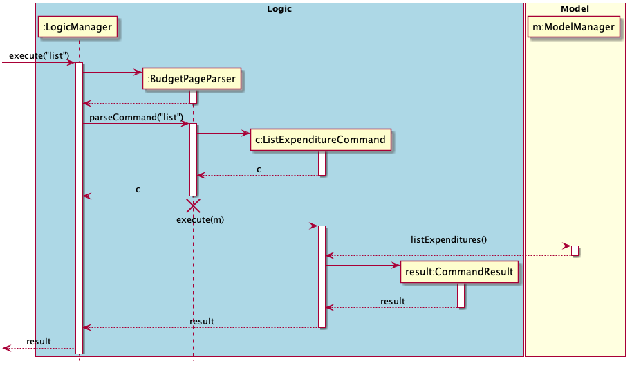

Figure 4.3.5.3.1.: Sequence diagram for list expenditure command in budget page view.

1. The `LogicManager` uses the `BudgetPageParser` to parse the give user input.
2. The `BudgetPageParser` will identify the command given by the user and create a `ListExpenditureCommand`.
3. The `BudgetPageParser` will then return the `ListExpenditureCommand` object back to the `LogicManager`.
4. `LogicManager` will now call the `execute` method in the `ListExpenditureCommand` object.
5. The `ListExpenditureCommand` `execute` method will now call the `listExpenditure` method of the existing `Model` object and
list all existing expenditures within the current budget.
6. The `ListExpenditureCommand` then returns a `CommandResult` indicating the successful listing of all expenditures.

With the above sequence, all expenditures will be listed by the user in his NUSave application, and it will be reflected
on the user interface.

##### 4.3.5.4 Find Expenditure

(Contributed by Chin Hui)

The following sequence diagram shows the interactions between the `Logic` and `Model` components of NUSave,
depicting a scenario where the user would like to find expenditures in a budget by a search term/phrase.

Figure 4.3.5.4.1.: Sequence diagram for find expenditure command in budget page view.

1. The `LogicManager` uses the `BudgetPageParser` to parse the give user input.
2. The `BudgetPageParser` will identify the command given by the user and pass the user input down to the 
`FindExpenditureCommandParser`.
3. The `FindExpenditureCommandParser` will then create a `FindExpenditureCommand` with the user input as the search term.
4. `FindExpenditureCommandParser` then returns the `FindExpenditureCommand` object back to the `LogicManager`.
5. The `LogicManager` will now call the `execute` method in the `FindExpenditureCommand` object.
6. The `FindExpenditureCommand` `execute` method will now call the `findExpenditures` method of the existing `Model` object and
apply a filter for expenditures displayed by NUSave.
7. The `FindExpenditureCommand` then returns a `CommandResult` indicating that all expenditures in the current budget
 containing the search term has been displayed.

With the above sequence, all expenditures containing the search term entered will be filtered 
and displayed on the user interface.

#### 4.3.6. Undo & Redo Commands
(Contributed by Wen Hao)

The undo and redo commands are implemented using the following classes:

| Class             | Details            | Purpose |
| -------- | --------------------------- | -------------- |
| `VersionedNusave` | Contains a `BudgetList` and `BudgetIndex` | Represents the data and view of NUSave at a certain point in time |
| `Node<T>`         | Contains a value of type `T`, next `Node<T>` and previous `Node<T>` | Represents a doubly linked list |
| `HistoryManager<T>` | Contains a pointer to a `Node<T>` | Represents an iterator to iterate through a doubly linked list represented by `Node<T>` |

The following class diagram shows how the classes interact with each other:

The pointer in `HistoryManager<VersionedNusave>` is always pointing to the latest `VersionedNusave` in a doubly linked list represented by `Node<T>`. If an undo command is executed, it will load the previous `VersionedNusave` and move the pointer backward. If a redo command is executed, it will load the next `VersionedNusave` and move the pointer forward. Whenever the user makes changes to NUSave data, a `VersionedNusave` is instantiated with a deep copy of the `BudgetList` from `Nusave` and the `BudgetIndex` from `State`. It replaces the next `Node<T>` (if any) of the `Node<T>` that `HistoryManager<VersionedNusave>` is currently pointing to before the pointer is moved forward.

To better illustrate the process, an example usage shown below:

Step 1: The user launches NUSave. `HistoryManager<VersionedNusave>` is instantiated with an empty doubly linked list.

Step 2: The user makes changes to NUSave data by creating a `Budget` named "demo". Before the change is made, a `VersionedNusave` is instantiated in case the user wants to undo. `HistoryManager<VersionedNusave>` adds this `VersionedNusave` to the doubly linked list.

Step 3: The user executes the undo command. Before reverting the changes, a `VersionedNusave` is instantiated in case the user wants to redo. `HistoryManager<VersionedNusave>` adds this `VersionedNusave` to the doubly linked list before moving its pointer backward to retrieve the previous `VersionedNusave`. The `BudgetList` from the previous `VersionedNusave` is loaded into `Nusave` while the `BudgetIndex` from the previous `VersionedNusave` is used to set `State`. Once this is done, the GUI should reflect that the "demo" budget is removed from NUSave.

Step 4: The user executes the redo command. `HistoryManager<VersionedNusave>` retrieves the next `VersionedNusave` from the pointer and moves its pointer forward. The `BudgetList` from the next `VersionedNusave` is loaded into `Nusave` while the `BudgetIndex` from the next `VersionedNusave` is used to set `State`. Once this is done, the GUI should reflect that the "demo" budget is added back to NUSave.

Step 5: The user makes changes to NUSave data by creating a `Budget` named "demo2". Before the change is made, a `VersionedNusave` is instantiated in case the user wants to undo. `HistoryManager<VersionedNusave>` adds this `VersionedNusave` to the doubly linked list before moving its pointer forward.

The following sequence diagram shows how the undo command is executed:

#### 4.3.7. Universal Commands

#### 4.3.7.1 Help

(Contributed by Yu Ming)

This section explains the `Help Command`.

The following activity diagram to shows the events that occur when the user executes the Help Command.

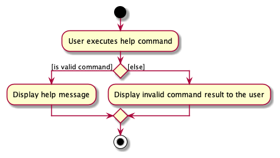 

Figure 4.3.7.1.1: Activity diagram for help command.

The following command can occur either in the `Main Page` or `Budget Page` of NUSave, and the help notes will be
displayed in the result box of the UI Component.

The following sequence diagram shows the interactions between the `Logic` and `Model` components of NUSave,
depicting a scenario where the user would like to ask for help to be displayed. 

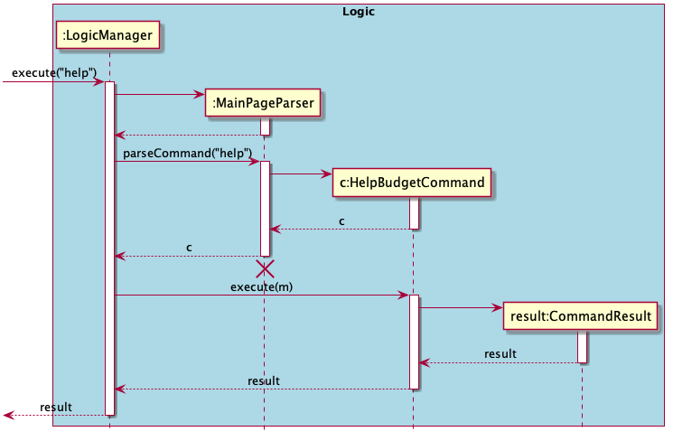

Figure 4.3.7.1.2: Sequence diagram for help command in main page view.
>Lifelines with a destroy marker (X) should end at the destroy marker (X) but due to a limitation of PlantUML, 
the lifeline reaches the end of diagram.

1. Beginning with the `LogicManager`, the `LogicManager` hands the given user input to the `MainPageParser` 
to be parsed.
2. The `MainPageParser` will identify the command given by the user and create an `HelpBudgetCommand`.
3. The `MainPageParser` will then return the `HelpBudgetCommand` object back to the `LogicManager`.
4. `LogicManager` will now call the `execute` method in the `HelpBudgetCommand` object, with the `Model` as a 
parameter.
5. The `HelpBudgetCommand`'s `execute` method will return a `CommandResult` indicating the successful calling for the
help command, and the help information will be displayed in the result box in NUSave. 

With the above sequence, the help information will be successfully shown to the user in NUSave, and it will be reflected 
on the user interface.

Note that the `help` command can be executed on `Budget Page` view as well, but it will display a different set of help
message that is unique to the `Budget Page` view with commands that can be executed on the view.

### 4.4. UI

This section elaborates on the implementations of various `Ui` features.

#### 4.4.1. List View Rendering

(Contributed by Wen Hao)

This section talks about how budget and expenditure cards are rendered within the List View UI component on the GUI of NUSave.

As there is a need to constantly re-render the contents within the List View to reflect user changes, we have adopted the **Observer Pattern**
so that data can be sent from the `Model` component to the `UI` component efficiently. Using the JavaFX API, the List View is binded to an `ObservableList`
such that any changes to the `ObservableList` will trigger an update within the List View accordingly.

Figure 4.4.1.1. Class diagram to illustrate the observer pattern

The List View UI component is able to display both budget and expenditure cards interchangeably through the `Renderable` interface.
Both `Budget` and `Expenditure` classes implement the `Renderable` interface.
As such, `Budget` and `Expenditure` objects can be added to the `ObservableList` of `Renderable` which the List View is binded to.
Whenever changes are made to the `ObservableList`, the List View generates either a `BudgetCard` or `ExpenditureCard` depending on the runtime type of the `Renderable` object.

To facilitate sort and find commands, an additional layer of filtering is accomplished using the `FilteredList` class. Different types of predicates are
supplied to the filtered list depending on user needs.

**Design Considerations**

* Option A: Use separate List Views for `Budget` and `Expenditure`
   * Pros: Less prone to the error where both `BudgetCard` and `ExpenditureCard` are displayed simultaneously
   * Cons: Higher difficulty and more code to write as there is the need to handle the replacement of the entire List View

* **Option B (Chosen):** Use a single List View to hold both `Budget` and `Expenditure` with the use of a `Renderable` interface
   * Pros: Easier to extent as new classes just need to implement the `Renderable` interface to be displayed
   * Cons: More prone to the error where both `BudgetCard` and `ExpenditureCard` are displayed simultaneously

#### 4.4.2. Dynamic Updating

(Contributed by Song Yu)

This section talks about how data is dynamically updated on the GUI of NUSave.  

As an overview, we use the **Observer Pattern** to dynamically update these modified data. We force this communication by 
using a `StateBinder` interface, where `bind()` is called to bind all `StateBinders` to `StateManager`.

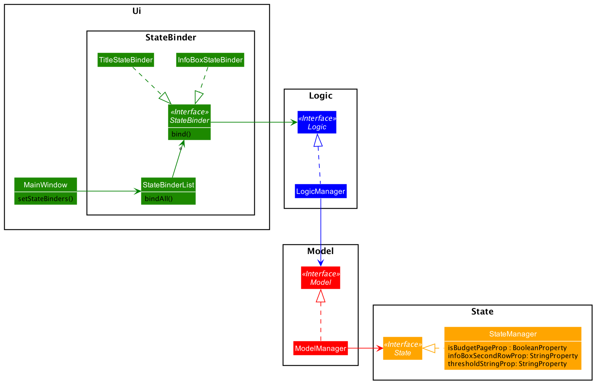

Figure 4.4.2.1. Observer Pattern Illustration

1. On initialisation of NUSave, `MainWindow` calls `this.setStateBinders()`, which calls `StateBinderList.bindAll()`.
2. `StateBinderList` calls `bind()` on every `StateBinder`. 
3. `bind()` will connect to `isBudgetPageProp`, `infoBoxSecondRowProp` and `thresholdStringProp` in `State`.
4. Whenever the attributes in `State` as referenced in step 3 are updated, the `StateBinders` are notified, which in turn
updates the GUI.

As seen, there is also a combination of the [**Facade Pattern**](https://nus-cs2103-ay2021s1.github.io/website/se-book-adapted/chapters/designPatterns.html#facade-pattern)
and [**N-tier Architectural Style**](https://nus-cs2103-ay2021s1.github.io/website/se-book-adapted/chapters/architecture.html#n-tier-architectural-style) 
to link `StateBinder` and `StateManager` together.

##### 4.4.2.1. Description

When a page switches from the main page to a budget page, information in the `InfoBox` and `Title` UI classes are updated.
When the `StringProperty` and `BooleanProperty` attributes are updated in `State`, the observers in `InfoBox` and `Title`
are notified, which updates the data displayed.  

###### 4.4.2.2. Implementation

The change in information displayed occurs when the user inputs one of the following commands:
1. Opening a budget: `open`
2. Closing a budget: `close`
3. Adding an expenditure: `add`
4. Editing an expenditure: `edit`
5. Deleting an expenditure: `delete`

###### Sequence Diagram

The following sequence diagram shows the interactions between the `Ui`, `Logic`,`Model` and `State` components of NUSave,
depicting a scenario where the user opens a budget.

Figure 4.4.2.2.1.1. Sequence Diagram for Open Command

1. `MainWindow` is called with the String `open 1`.
2. `MainWindow` uses `LogicManager` to execute the given user input.
1. The `LogicManager` uses the `MainPageParser` to parse the given user input.
2. The `MainPageParser` identifies the command given by the user and creates an `OpenBudgetCommandParser`.
3. The `MainPageParser` passes the user input into the newly created`OpenBudgetCommandParser`.
4. The `OpenBudgetCommandParser` creates a `OpenBudgetCommand` object.
5. The `OpenBudgetCommandParser` returns the `OpenBudgetCommand` object back to `LogicManager`.
6. `LogicManager` calls the `execute` method in the `OpenBudgetCommand` object, with the `Model` as a 
parameter.
7. The `OpenBudgetCommand`'s `execute` method calls the `openBudget` method of the existing 
`Model` object passed in.
8. `ModelManager` calls its own `setOpenCommandState` method, which retrieves relevant data to update `State`.
9. `ModelManager` calls `State`'s `setOpenCommandState` method, updating state data relevant to opening a budget.
10. `State`'s `StringProperty` and `BooleanProperty` attributes are updated, which notifies `InfoBox`
and `Title` to update.

With the above sequence, a budget will successfully be opened, and the `Title` component reflects the name of 
the budget, while the `InfoBox` component reflects the total expenditure and threshold of the budget.

**Design Considerations**

* Option A: Use Model-View Controller (MVC) Pattern to update GUI
   * Pros: Good separation of concern, with controller being in charge of updating both the model and Ui.
   * Cons: Hard to implement as controllers will have to be set up from scratch.

* **Option B (Chosen):** Use Observer Pattern to update GUI
   * Pros: Able to use proprietary JavaFx library to implement, enforce loose coupling with Observer interface.
   * Cons: External code can easily invoke observer as `bind()` method is public. 

## 5. Guides

### 5.1. Documentation

* [Documentation guide](Documentation.md)

### 5.2. Testing

* [Testing guide](Testing.md)

### 5.3. Logging

* [Logging guide](Logging.md)

### 5.4. Configuration

* [Configuration guide](Configuration.md)

### 5.5. DevOps

* [Dev Ops guide](DevOps.md)

## Appendix

### Product Scope

(Contributed by Wen Hao)

**Target User Profile:**

* students staying on campus
* has a need to manage a significant number of budgets and expenditures
* prefers using desktop over other platforms
* types fast and prefers typing to mouse interactions
* is comfortable using CLI applications

**Value Proposition:** 

* manages expenditures faster than a typical mouse/GUI driven application
* allows users to keep track of their budgets on a centralised platform

### User Stories

(Contributed by Yu Ming and David)

Priorities: 
* High (must have) - `* * *` 
* Medium (nice to have) - `* *`
* Low (unlikely to have) - `*`

| Priority | As a …​                                 | I want to …​                | So that I can…​                                                     |
| -------- | ------------------------------------------ | ------------------------------ | ---------------------------------------------------------------------- |
| `* * *`  | new user                                   | see a list of available commands | refer to instructions when I forget how to use the application       |
| `* * *`  | user                                       | create a budget                | add a new budget that I need                                           |
| `* * *`  | user                                       | delete a budget                | remove a budget that I no longer need                                  |
| `* * *`  | user                                       | open a budget                  | view the expenditures of a budget                                      |
| `* * *`  | user                                       | close a budget                 | return to the main window                                              |
| `* * *`  | user                                       | add an expenditure             | add a new expenditure to a budget                                      |
| `* * *`  | user                                       | delete an expenditure          | remove an expenditure that I no longer need                            |
| `* *`    | user                                       | find an expenditure by name    | locate an expenditure easily                                           |

### Use Cases

#### Use Case: UC01 - Viewing the help menu
(Contributed by Yu Ming)

System: NUSave
 Use Case: UC01 - Viewing the help menu
 Actor: User
 MSS:
1. User enters the command to show the help menu in NUSave.
2. NUSave displays the help menu to the user.
  Use case ends.

**Extensions**
- 1a. NUSave detects an error in the entered command.
    - 1a1. NUSave shows an error message.
    - 1a2. User enters new command.
      Steps 1a1-1a2 are repeated until the command entered is correct.
      Use case resumes at step 2.

#### Use Case: UC02 - Creating a budget
(Contributed by Yu Ming)

System: NUSave
 Use Case: UC02 - Creating a budget
 Actor: User
 Preconditions: User is on the main page
 MSS:
1. User enters the command to add a new budget in NUSave.
2. NUSave adds the new budget and displays the updated list of budgets to the user.
  Use case ends.

**Extensions**
- 1a. NUSave detects an error in the entered command (for example, an invalid threshold).
    - 1a1. NUSave shows an error message.
    - 1a2. User enters a new command.
      Steps 1a1-1a2 are repeated until the command entered is correct.
      Use case resumes at step 2.

#### Use Case: UC03 - Editing a budget
(Contributed by Yu Ming)

System: NUSave
 Use Case: UC03 - Editing a budget
 Actor: User
 Preconditions: User is on the main page
 MSS:
1. User enters the command to edit a budget in NUSave.
2. NUSave replaces the old budget with the newly edited budget and displays the updated list of budgets to the user.
  Use case ends.

**Extensions**
- 1a. NUSave detects an error in the entered command.
    - 1a1. NUSave shows an error message.
    - 1a2. User enters new command.
      Steps 1a1-1a2 are repeated until the command entered is correct.
      Use case resumes at step 2.
- 1b. NUSave detects that the given budget does not exist in NUSave.
    - 1b1. NUSave shows an error message.
    - 1b2. User enters new command.
      Steps 1b1-1b2 are repeated until the command entered is correct.
      Use case resumes at step 2.
    

#### Use Case: UC04 - Deleting a budget

MSS (Contributed by David)

1. User request to delete a budget in the main page view.
2. NUSave deletes the budget.
  Use case ends.

**Extensions**

- 1a. User provides invalid command format to delete a budget.
    - 1a1. NUSave shows an error message.
- 1b. The given index does not exist.
    - 1b1. NUSave shows an index out of range message.

#### Use Case: UC05 - Opening a budget

MSS (Contributed by Song Yu)

System: NUSave
 Use Case: UC05 - Opening a budget
 Actor: User
 Preconditions: User is on the main page
 MSS:
1. User enters the command to open a budget in NUSave.
2. NUSave opens the budget displays the list of expenditures belonging to that budget to the user.
  Use case ends.

**Extensions**
- 1a. NUSave detects an error in the entered command.
    - 1a1. NUSave shows an error message.
    - 1a2. User enters new command.
      Steps 1a1-1a2 are repeated until the command entered is correct.
      Use case resumes at step 2.

#### Use Case: UC06 - Closing a budget

MSS (Contributed by Song Yu)

System: NUSave
 Use Case: UC06 - Closing a budget
 Actor: User
 Preconditions: User is on the budget page
 MSS:
1. User enters the command to close a budget in NUSave.
2. NUSave closes the budget and displays the list of budgets in NUSave.
  Use case ends.

**Extensions**
- 1a. NUSave detects an error in the entered command.
    - 1a1. NUSave shows an error message.
    - 1a2. User enters new command.
      Steps 1a1-1a2 are repeated until the command entered is correct.
      Use case resumes at step 2.

#### Use Case: UC07 - Sorting budgets
(Contributed by Yu Ming)

System: NUSave
 Use Case: UC07 - Sorting budgets
 Actor: User
 Preconditions: User is on the main page
 MSS:
1. User enters the command to sort budgets in NUSave.
2. NUSave sorts all budgets and displays the updated list of budgets to user.
  Use case ends.

**Extensions**
- 1a. NUSave detects an error in the entered command.
    - 1a1. NUSave shows an error message.
    - 1a2. User enters new command.
      Steps 1a1-1a2 are repeated until the command entered is correct.
      Use case resumes at step 2.
- 1b. NUSave detects that there are no budgets in NUSave.
    - 1b1. User <ins>create budgets (UC02)</ins> before sorting.
      Steps 1b1 is repeated until 2 or more budgets are available in NUSave for sorting.
      Use case resumes at step 2.

#### Use Case: UC08 - Finding budgets

#### Use Case: UC09 - Listing budgets

#### Use Case: UC10 - Adding an expenditure

MSS (Contributed by Song Yu)

System: NUSave
 Use Case: UC10 - Adding an expenditure
 Actor: User
 Preconditions: User is on the budget page
 MSS:
1. User enters the command to add a new expenditure in NUSave.
2. NUSave adds the new expenditure and displays the updated list of expenditures to the user.
  Use case ends.

**Extensions**
- 1a. NUSave detects an error in the entered command (for example, an invalid price).
    - 1a1. NUSave shows an error message.
    - 1a2. User enters new command.
      Steps 1a1-1a2 are repeated until the command entered is correct.
      Use case resumes at step 2.

#### Use Case: UC11 - Editing an expenditure

MSS (Contributed by David)

1. User requests to open a budget (UC05) to view the list of expenditures in the budget page view.
2. NUSave opens the budget.
3. User requests to edit an existing expenditure within the budget.
4. NUSave edits the expenditure.
  Use case ends.

**Extensions**

- 3a. User provides invalid expenditure details (for example, an invalid price).
    - 3a1. NUSave shows an error message.
- 3b. The given budget does not exist.
    - 3b1. NUSave shows an error message.
      Use case resumes at step 3.

#### Use Case: UC12 - Deleting an expenditure

MSS (Contributed by David)

1. User requests to open a budget (UC05) to view the list of expenditures in the budget page view.
2. NUSave opens the budget.
3. User request to delete an expenditure within the budget.
4. NUSave deletes the expenditure.
  Use case ends.

**Extensions**

- 3a. User provides invalid command format to delete an expenditure.
    - 1a1. NUSave shows an error message.
- 3b. The given index does not exist.
    - 1b1. NUSave shows an error message.
      Use case resumes at step 3.

#### Use Case: UC15 - Sorting expenditures
(Contributed by Yu Ming)

System: NUSave
 Use Case: UC15 - Sorting expenditures
 Actor: User
 Preconditions: User is on the budget page
 MSS:
1. User requests to <ins>open a budget (UC05)</ins> to view the list of expenditures in the budget page view.
2. NUSave opens the budget and displays the list of expenditures belonging to that budget.
3. User enters the command to sort expenditures in NUSave.
4. NUSave sorts the expenditures and displays the updated list to the user.
  Use case ends.

**Extensions**
- 3a. NUSave detects an error in the entered command.
    - 3a1. NUSave shows an error message.
    - 3a2. User enters new command.
      Steps 3a1-3a2 are repeated until the command entered is correct.
      Use case resumes at step 4.
- 3b. NUSave detects that there are no expenditures in given budget.
    - 3b1. User <ins>add expenditures (UC10)</ins> before sorting.
      Steps 3b1 is repeated until 2 or more expenditure are available in budget for sorting.
      Use case resumes at step 4.

#### Use Case: UC16 - Finding expenditures

#### Use Case: UC17 - Listing expenditures

#### Use Case: UC18 - Undoing an action

#### Use Case: UC19 - Redoing an action

### Non-Functional Requirements

(Contributed by Chin Hui)

1.  Should work on any _mainstream OS_ as long as it has Java `11` or above installed.
2.  Should be able to hold up to 1000 budgets and expenditures without a noticeable sluggishness in performance for typical usage.
3.  A user with above average typing speed for regular English text (i.e. not code, not system admin commands) should be able to accomplish most of the tasks at a fast speed.

### Glossary

(Contributed by Song Yu)

| Term | Explanation |
| ---- | ----------- |
| Expenditure                 | Refers to a single item to be recorded in NUSave.                                                                                                                              
| Budget                      | Refers to how NUSave stores related expenditures under one group. A budget can also hold additional information about this list of expenditures, such as the target limit of what is to be spent (i.e. threshold). 
| Main Page                   | Refers to the page that displays the list of budgets that is stored in NUSave.                                                                                                 
| Budget Page                 | Refers to the page that displays the list of expenditures belonging in a specific budget that is stored in NUSave.                                                             
| Threshold                   | Refers to the target limit that can be spent in that budget.
| PlantUML                    | A software tool used by NUSave's team to render UML diagrams in this developer guide. 
| NUS                         | Stands for National University of Singapore.
| API                         | Stands for 'Application Programming Interface', which abstracts away underlying implementation and only exposes objects or methods a developer needs.
| JSON                        | Stands for 'Javascript Standard Object Notation', which is a form of syntax used for storing data. 
| CLI                         | Stands for **Command Line Interface**. CLI-based Applications (i.e. NUSave) focuses on processing commands in the form of text entered from the keyboard.                       
| GUI                         | Stands for **Graphical User Interface**. GUIs work as the communication channel between the program and the user. Users interact with NUSave through the GUI, on their devices. 
| UML                         | Stands for 'Unified Modeling Diagram'. A general-purpose, standardized modeling language used in the field of software engineering.
| NFR                         | Stands for 'Non-functional Requirements', which specifies the constraints under which the system is developed and operated.
| Mainstream OS               | Stands for 'Mainstream Operating Systems', such as Windows, MacOS, Linux, Unix, OS-X.
| MSS                         | Stands for 'Main Success Scenario', which describes the interaction for a given use case, assuming nothing goes wrong.

### Instructions for Manual Testing

(Contributed by Chin Hui)

Given below are instructions to test the application manually:

#### Launch and Shutdown
1. Launching the application

   1. Download the jar file and copy into an empty folder.

   1. Double-click the jar file. 
   Expected: Shows the GUI with a set of sample budgets. The window size may not be optimum.

1. Saving window preferences

   1. Resize the window to an optimum size. Move the window to a different location. Close the window.

   1. Re-launch the application by double-clicking the jar file. 
   Expected: The most recent window size and location is retained.

#### Deletion
1. Deleting a budget

   1. Prerequisites: User is in the main page. Multiple budgets are in the list.

   1. Test case: `delete 1` 
      Expected: First budget is deleted from the list. Details of the deleted budget is shown in the status message.
      Timestamp in the status bar is updated.

   1. Test case: `delete 0` 
      Expected: No budget is deleted. Error details shown in the status message. Status bar remains the same.

   1. Other incorrect delete commands to try: `delete`, `delete x`, `...` (where x is larger than the list size) 
      Expected: Similar to previous.

### Effort
