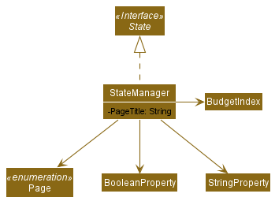
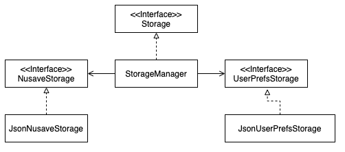
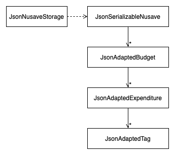
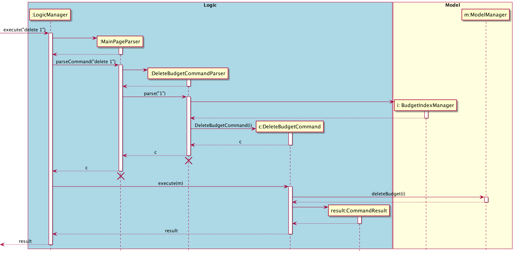
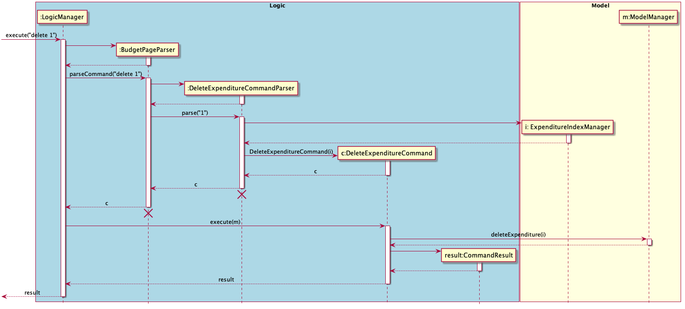
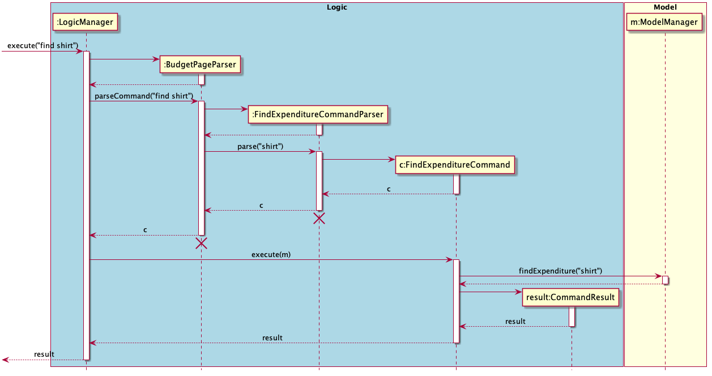

## Table of Contents
- [1. Introduction](#1-introduction)
- [2. Setting Up](#2-setting-up)
- [3. Design](#3-design)
    * [3.1. Architecture](#31-architecture)
    * [3.2. Components](#32-components)
        * [3.2.1 UI Component](#321-ui-component)
        * [3.2.2 Logic Component](#322-logic-component)
        * [3.2.3 Model Component](#323-model-component)
        * [3.2.4 State Component](#324-state-component)
        * [3.2.5 Storage Component](#325-storage-component)
    * [3.3. Interaction Between Components](#33-interaction-between-components)
    * [3.4. Commons Classes](#34-commons-classes)
- [4. Implementation](#4-implementation)
    * [4.1. State](#41-state)
    * [4.2. Parsers](#42-parsers)
        * [4.2.1. Page Parsers](#421-page-parsers)
        * [4.2.2. Command Parsers](#422-command-parsers)
        * [4.2.3. Interaction Between Parsers](#423-interaction-between-parsers)
    * [4.3. Commands](#43-commands)
        * [4.3.1. Add Commands](#431-add-commands)
            * [4.3.1.1. Create Budget](#4311-create-budget)
            * [4.3.1.2. Add Expenditure](#4312-add-expenditure)
        * [4.3.2. Delete Commands](#432-delete-commands)
            * [4.3.2.1. Delete Budget](#4321-delete-budget)
            * [4.3.2.2. Delete Expenditure](#4322-delete-expenditure)
        * [4.3.3. Edit Commands](#433-edit-commands)
            * [4.3.3.1. Edit Budget](#4331-edit-budget)
            * [4.3.3.2. Edit Expenditure](#4332-edit-expenditure)
        * [4.3.4. Sort Commands](#434-sort-commands)
        * [4.3.5. Find & List Commands](#435-find--list-commands)
    * [4.4. UI](#44-ui)
        * [4.4.1. List View Rendering](#441-list-view-rendering)
        * [4.4.2. Dynamic Updating](#442-dynamic-updating)
            * [4.4.2.1. Description](#4421-description)
            * [4.4.2.2. Implementation](#4422-implementation)
    * [5. Guides](#5-guides)
        * [5.1. Documentation](#51-documentation)
        * [5.2. Testing](#52-testing)
        * [5.3. Logging](#53-logging)
        * [5.4. Configuration](#54-configuration)
        * [5.5. DevOps](#55-devops)
    * [6. Appendix](#6-appendix)
        * [6.1. Requirements](#61-requirements)
            * [6.1.1. Product Scope](#611-product-scope)
            * [6.1.2. User Stories](#612-user-stories)
            * [6.1.3. Use Cases](#613-use-cases)
            * [6.1.4. Non-Functional Requirements](#614-non-functional-requirements)
        * [6.2. Glossary](#62-glossary)
        * [6.3. Instructions for Manual Testing](#63-instructions-for-manual-testing)
        * [6.4. Effort](#64-effort)

## 1. Introduction

### Overview
NUSave is a budgeting tool made for **university students staying on campus** who want to be able to track and manage 
their own expenditures with ease. As students, it is common for them to have limited income during their academic years.
Therefore, it is especially necessary for those living independently to plan their finances prudently to ensure that
they do not overspend their tight budget.

A typical student staying on campus has to keep track of: 
* daily expenses
* club finances
* project budgets
* administrative fees

Rather than having multiple documents and spreadsheets to keep track of their budgets, NUSave allows students to
conveniently manage all their expenditures under one centralised platform.

NUSave implements both **Command Line Interface (CLI)** and **Graphical User Interface (GUI)**.
In other words, users interact with the application through the command line and the GUI will reflect their actions.

### Purpose
This document acts as a guide for developers, testers, and designers describing both the architecture and design 
of NUSave.

## 2. Setting Up
Refer to the guide [_Setting up and getting started_](SettingUp.md).

## 3. Design

### 3.1. Architecture

The ***Architecture Diagram*** given above explains the high-level design of the application.

Given below is a quick overview of each component:

**`Main`** has two classes called [`Main`] and [`MainApp`].
It has two primary responsibilities:
* At launch: Initializes the components in the correct sequence, and connects them up with each other.
* At shut down: Shuts down the components and invokes cleanup methods where necessary.

[**`Commons`**](#common-classes) represents a collection of classes used by multiple other components.

The rest of the application consists of five components:

1. [**`UI`**](#ui-component): Handles the UI of the application.
1. [**`Logic`**](#logic-component): Executes the commands.
1. [**`Model`**](#model-component): Holds the data of the application in memory.
1. [**`Storage`**](#storage-component): Reads data from, and writes data to, the hard disk.
1. [**`State`**](#state-componenet): Remembers the current state of the application.

For each of the five components:

* Its API is defined in an `interface` with the same name as the Component.
* Its functionality is exposed using a concrete `{Component Name} Manager` class which implements the corresponding API
`interface` mentioned in the previous point.
    - For example, the `Logic` component defines its API in the `Logic.java` interface and exposes its functionality
    using the `LogicManager.java` class which implements the `Logic` interface.

The ***Class Diagram*** given above shows how the five components interact with each other.

The ***Sequence Diagram*** given above shows how the components interact with each other for the scenario where the user
issues the command `delete 1`.

The sections below give more details of each component:

### 3.2. Components

#### 3.2.1. UI Component

**API**: `Ui.java`

The UI consists of a `MainWindow` that is made up of parts e.g.`CommandBox`, `ResultDisplay`,
`StatusBarFooter` etc. All these, including the `MainWindow`, inherit from the abstract `UiPart` class.

The `UI` component uses JavaFx UI framework. The layout of these UI parts are defined in matching `.fxml` files that are in the `src/main/resources/view` folder. For example, the layout of the `MainWindow` is specified in `MainWindow.fxml`.

In order to dynamically render data to be displayed to the user, when `fillInnerParts()` in `MainWindow` is called, 
the method `setStateBinders()` sets Observer objects to observe changes in `State`. For a complete explanation,
refer to [4.4.2. Dynamic Updating](#442-dynamic-updating).

In summary, the `UI` component:

* Executes user commands using the `Logic` component.
* Listens for changes to `Model` and `State` data so that the UI can be updated with the modified data.

#### 3.2.2. Logic Component

**API**: `Logic.java`

`Logic` uses the `PageParser` class to parse the user command. This results in a `Command` object which is
executed by the `LogicManager`. The command execution can affect the `Model` (e.g. adding an expenditure). The result of
the command execution is encapsulated as a `CommandResult` object which is passed back to the `Ui`. In addition, the
`CommandResult` object can also instruct the `Ui` to perform certain actions, such as displaying help to the user.

The ***Sequence Diagram*** given above represents the interactions within the `Logic` component for the
`execute("delete 1")` API call.

#### 3.2.3. Model Component
(Contributed by Chin Hui)

Figure 3.4.1: Structure of the model component.

**API** : `Model.java`

The `Model`:

* Stores a `UserPref` object that represents the user’s preferences.
* Stores a `Nusave` object that encapsulates `Budget` and `Expenditure` data.
* Exposes an unmodifiable `FilteredList<Renderable>` 
that can be 'observed' e.g. the UI can be bound to this list so
that the UI automatically updates when the data in the list change.
* Does not depend on any of the other three components.
* `FilteredList` was used in favor of `ObservableList` to facilitate the find command implementation.
Now the list can be filtered based on a `Predicate`, allowing for more flexibility for other 
filtering extensions i.e. filter by number of expenditures.

The `Nusave`:

* Implements methods that interface with the `Budget` and `Expenditure` 
data following the "Tell, Don't Ask" Principle.
* Stores an `ObservableList<Renderable>` that is passed up to populate the `FilteredList<Renderable>`.
* Stores a `BudgetList` (wrapper class for a `List<Budget>`) as well to access `Expenditures` within a `Budget` since
`Expenditures` cannot be accessed through `ObservableList<Renderable>`.

The `Budget`:
* Implements the Renderable interface and can thus be stored in the FilteredList.
* Contains a `Name`, `Date`, `Optional<Threshold>` and a `List<Expenditure>`.

The `Expenditure`:
* Implements the Renderable interface and can thus be stored in the FilteredList.
* Contains a `Name`, `Date`, `Price` and `Set<Tag>`.

#### 3.2.4. State Component
 (Contributed by Song Yu)
 
 ***API***: `State.java`
 
 The `State` component:
 * Stores a `BudgetIndex` instance that represents the budget that `NUSave` is currently displaying.
 * Stores a `Page` enumeration that represents the type of `Page` NUSave is currently on. 
 * Stores a `BooleanProperty` instance that triggers a callback on change of `boolean` value, updating the page title 
 of the current page.
 *  Stores a `String` value which represents the title of the current page.
 
 `State` is used by `Model` to track the current state of NUSave. When a command that requires a different budget book
 or list of budgets to be displayed is called, `State` will store information of the new page being displayed. This information
 will be used when different commands are entered which requires `model` to know the current `state` of NUSave.
 
 Using the current `Page` of NUSave, commands are parsed separately by either `BudgetPageParser` or `MainPageParser`. 
 Thus, commands with similar names but belonging to different parsers will have different implementations and classes.
 For example, a command like `list` will have different implementations, as a `ListExpenditureCommand` 
 or `ListBudgetCommand.`
 
 
 
 Figure 3.5.1: Structure of the state component.
 

#### 3.2.5. Storage Component
(Contributed by Wen Hao)

**API** : `Storage.java`

The `Storage` component:
* Can save `UserPref` objects in JSON format and read it back.
* Can save all NUSave data in JSON format and read it back.

Figure 3.6.1: Structure of the storage component.

The `Storage` component uses the Jackson API to convert Plain Old Java Objects (POJOs) into JSON files which are then
stored locally. It uses the same API to read existing JSON files during the launch of the application to load the stored
data into `NUSave`. As seen in Figure 3.6.1, `JsonUserPrefsStorage` is responsible for the reading and writing of
`UserPref` objects and contains the file path of its JSON file while `JsonNusaveStorage` is responsible for the
reading and writing of all NUSave data and contains the file path of its JSON file.

Figure 3.6.2: Structure of the data stored by NUSave.

In order for them to be recognised by the Jackson API, NUSave data objects (such as `Budget` and `Expenditure`) must be
converted into POJOs. Figure 3.6.2 depicts how the respective POJO classes for each of the data objects interact with
one another.

### 3.3. Interaction Between Components

### 3.4. Commons Classes
Classes used by multiple components are in the `seedu.addressbook.commons` package.

## 4. Implementation

### 4.1. State

### 4.2. Parsers

#### 4.2.1. Page Parsers

#### 4.2.2. Command Parsers

#### 4.2.3. Interaction Between Parsers

### 4.3. Commands

#### 4.3.1. Add Commands

This section describes the details surrounding events at which users would wish to add information into NUSave. 
Specifically, when a user wishes to create a new budget to the Main Page, or when a user wishes to add an expenditure
to a budget.

##### 4.3.1.1. Create Budget
(Contributed by Yu Ming)

The following Sequence Diagram shows the interaction between the `Logic` component and `Model` component of NUSave 
depicting a scenario when the user wants to create a budget for his Temasek Hall basketball CCA by entering the command
`create n/Temasek Hall Basketball p/100`.

 

Figure 4.3.1.1: Sequence diagram  for create budget command in main page view.

1. The `LogicManager` uses the `MainPageParser` to parse the given user input.
2. The `MainPageParser` will identify the command given by the user and pass the user input down to the
`CreateBudgetCommandParser`.
3. The `CreateBudgetCommandParser` will create a `Budget` with the given parameters **name** and **threshold** from the
user input.
4. The `CreateBudgetCommandParser` will then create a `CreateBudgetCommand` object with the created `Budget` object as
the input parameter.
5. The `CreateBudgetCommandParser` will then return a `CreateBudgetCommand` object.
6. `LogicManager` will now call the `execute` method in the `CreateBudgetCommand` object.
7. The `CreateBudgetCommand` will now call the `addBudget` method of the existing `Model` object and add the `Budget`
object created into NUSave.
8. The `CreateBudgetCommand` then returns a `CommandResult` indicating the successful addition of the `Budget` object.

With the above sequence, a budget will be successfully created by the user in his NUSave application, and it will be
reflected on the user interface.

##### 4.3.1.2. Add Expenditure
(Contributed by David)

This section explains the `Add Expenditure Command`.

Similar to creating a Budget, the add expenditure Command also shows the interaction between the `Logic` component 
and `Model` component of NUSave. The sequence diagram depicts a scenario when the user wants to add an expenditure for 
his budget by entering the command `add n/Basketball p/20 t/Ball`.

 

Figure 4.3.2.1: Sequence diagram  for add expenditure command in budget page view.

1. Beginning with the `LogicManager`, the `LogicManager` hands the given user input to the `BudgetPageParser` 
to be parsed.
2. The `BudgetPageParser` will identify the command given by the user and pass the user input down to the
`AddExpenditureCommandParser` to be parsed.
3. The `AddExpenditureCommandParser` will create an `Expenditure` with the given parameters **name**, **price** and
optionally **tags** from the user input.
4. The `AddExpenditureCommandParser` will then create an `AddExpenditureCommand` object with the created `Budget` 
object as the input parameter.
5. The `AddExpenditureCommandParser` will then return an `AddExpenditureCommand` object.
6. `LogicManager` will now call the `execute` method in the `AddExpenditureCommand` object.
7. The `AddExpenditureCommand` will now call the `addExpenditure` method of the existing `Model` object and add the 
`Expenditure` object created into NUSave.
8. The `AddExpenditureCommand` then returns a `CommandResult` indicating the successful addition of the `Expenditure`
object.

With the above sequence, an expenditure will be successfully created by the user in his NUSave application under 
the specific budget, and will be immediately reflected on the user interface.

#### 4.3.2. Delete Commands
(Contributed by David)
This section describes the details surrounding events at which users would wish to delete information from NUSave. 
Specifically, deletion can happen in two areas; when a user wishes to delete a budget from the Main Page, or when a 
user wishes to delete an expenditure from a budget.

##### 4.3.2.1. Delete Budget
(Contributed by David)

This section explains the `Delete Budget Command`.

The following command occurs in the `Main Page` of NUSave, and results in the specified budget of the particular index 
to be removed from NUSave. This command therefore requires a compulsory index to specify the particular budget to be 
removed.

Only when the index given by the user is valid (within the range of existing budgets), does the command execute 
successfully.

The following sequence diagram shows the interactions between the `Logic` and `Model` components of NUSave,
depicting a scenario where the user would like to delete the first budget on his list.

 

Figure 4.3.2.1.1: Sequence diagram  for delete budget command in main page view.

1. The `LogicManager` uses the `MainPageParser` to parse the given user input.
2. The `MainPageParser` will identify the command given by the user and pass the user input down to the
`DeleteBudgetCommandParser`.
3. The `DeleteBudgetCommandParser` will create a `BudgetIndex` with the given parameters **index**  from the
user input.
4. The `DeleteBudgetCommandParser` will then create a `DeleteBudgetCommand` object with the created `BudgetIndex`
object as the input parameter.
5. The `DeleteBudgetCommandParser` will then return a `DeleteBudgetCommand` object back to the `LogicManager`.
6. `LogicManager` will now call the `execute` method in the `DeleteBudgetCommand` object, with the `Model` as a 
parameter.
7. The `DeleteBudgetCommand`'s `execute` method will now call the `deleteBudget` method of the existing `Model` object
passed in and delete the `Budget` object within NUSave.
8. The `DeleteBudgetCommand` then returns a `CommandResult` indicating the successful deletion of the `Budget` object.

With the above sequence, a budget will be successfully deleted by the user in his NUSave application, and it will be
reflected on the user interface through the successful `CommandResult` and updated budget list.

##### 4.3.2.2. Delete Expenditure
(Contributed by David)

This section explains the `Delete Expenditure Command`.

The following command occurs in the `Budget Page` of NUSave, and results in the specified expenditure of the particular 
index to be removed from NUSave. This command therefore requires a compulsory index to specify the particular 
expenditure to be removed.

Only when the index given by the user is valid (within the range of existing budgets), does the command execute 
successfully.

The following sequence diagram is similar to `figure 4.3.2.1.1` which shows the interactions between the `Logic` and 
`Model` components of NUSave, depicting a scenario where the user within a budget would like to delete the first 
expenditure on his list.

Figure 4.3.2.2.1: Sequence diagram  for delete budget command in budget page view.

1. The `LogicManager` uses the `BudgetPageParser` to parse the given user input.
2. The `BudgetPageParser` will identify the command given by the user and create a `DeleteBudgetCommandParser`.
3. The `BudgetPageParser` will pass the user input into the newly created`DeleteBudgetCommandParser`.
3. The `DeleteExpenditureCommandParser` will create a `ExpenditureIndex` with the given parameters **index**  from the
user input.
4. The `DeleteExpenditureCommandParser` will then create a `DeleteExpenditureCommand` object with the created 
`ExpenditureIndex` object as the input parameter.
5. The `DeleteExpenditureCommandParser` will then return the `DeleteExpenditureCommand` object back to the 
`LogicManager`.
6. `LogicManager` will now call the `execute` method in the `DeleteExpenditureCommand` object, with the `Model` as a 
parameter.
7. The `DeleteExpenditureCommand`'s `execute` method will now call the `deleteExpenditure` method of the existing 
`Model` object passed in and delete the `Expenditure` object within NUSave.
8. The `DeleteExpenditureCommand` then returns a `CommandResult` indicating the successful deletion of the 
`Expenditure` object.

With the above sequence, a budget will be successfully deleted by the user in his NUSave application, and it will be
reflected on the user interface through the successful `CommandResult` and updated budget list.

#### 4.3.3. Edit Commands
(Contributed by David)

This section describes the details surrounding events at which users would wish to edit information from NUSave. 
Specifically, editing can happen in two areas; when a user wishes to edit a budget from the `Main Page`, or when a 
user wishes to edit an expenditure from a budget within the `Budget Page`.

##### 4.3.3.1. Edit Budget

##### 4.3.3.2. Edit Expenditure
(Contributed by David)

This section explains the `Edit Expenditure Command`.

The following command results in the specified expenditure of the particular index to be edited within the 
`Budget Page`. As such, this command requires a compulsory index to specify the particular expenditure, along with a
field at which the user would like to edit (`NAME`, `PRICE`, `TAG`).

Only when the index is valid (within the range of existing expenditures), and the user provides at least one field to 
be edited, does the command execute successfully.

The following sequence diagram shows the interactions between the `Logic` and `Model` components of NUSave,
depicting a scenario where the user would like to edit the first expenditure on his/her list, and change the previous 
`NAME`, `PRICE` and `TAG` to `Basketball`, `50` and `Ball` accordingly.

Figure 4.3.3.2.1: Sequence diagram  for delete edit command in budget page view.

1. Beginning with the `LogicManager`, the `LogicManager` hands the given user input to the `BudgetPageParser` 
to be parsed.
2. The `BudgetPageParser` will identify the command given by the user and create an `EditExpenditureCommandParser`.
3. The `BudgetPageParser` will pass the user input into the newly created `EditExpenditureCommandParser`.
4. The `EditExpenditureCommandParser` will create an `ExpenditureIndex` with the given parameters **index**  from the
user input.
5. The `EditExpenditureCommandParser` will then create an `EditExpenditureDescriptor` with the given parameters of 
**name**, **price** and **tags**.
6. The `EditExpenditureCommandParser` will then create an `EditExpenditureCommand` with the `Expenditure Index` and 
`EditExpenditureDescriptor`.
7. The `EditExpenditureCommandParser` will then return the `EditExpenditureCommand` object back to the `LogicManager`.
8. `LogicManager` will now call the `execute` method in the `EditExpenditureCommand` object, with the `Model` as a 
parameter.
7. The `EditExpenditureCommand`'s `execute` method will now call the `editExpenditure` method of the existing 
`Model` object passed in and update the `Expenditure` with a new `Expenditure` object within NUSave.
8. The `EditExpenditureCommand` then returns a `CommandResult` indicating the successful editing of the 
`Expenditure`.

With the above sequence, an expenditure will be successfully edited by the user in his NUSave application, and it will 
be reflected on the user interface through the successful `CommandResult` and updated budget list.

#### 4.3.4. Sort Commands

#### 4.3.5. Find & List Commands

##### 4.3.4.1 List Budget
(Contributed by Chin Hui)
The following sequence diagram shows the interactions between the `Logic` and `Model` components of NUSave,
depicting a scenario where the user would like to list all budgets.

Figure 4.3.4.1: Sequence diagram for list budget command in main page view.

1. The `LogicManager` uses the `MainPageParser` to parse the give user input.
2. The `MainPageParser` will identify the command given by the user and create a `ListBudgetCommand`.
3. The `MainPageParser` will then return the `ListBudgetCommand` object back to the `LogicManager`.
4. `LogicManager` will now call the `execute` method in the `ListBudgetCommand` object.
5. The `ListBudgetCommand` `execute` method will now call the `listBudgets` method of the existing `Model` object and
list all existing budgets within NUSave.
6. The `ListBudgetCommand` then returns a `CommandResult` indicating the successful listing of all budgets.

With the above sequence, all budgets will be listed by the user in his NUSave application, and it will be reflected
on the user interface.

##### 4.3.4.2 Find Budget
(Contributed by Chin Hui)
The following sequence diagram shows the interactions between the `Logic` and `Model` components of NUSave,
depicting a scenario where the user would like to find budgets by a search term/phrase.

Figure 4.3.4.1: Sequence diagram for find budget command in main page view.

1. The `LogicManager` uses the `MainPageParser` to parse the give user input.
2. The `MainPageParser` will identify the command given by the user and pass the user input down to the 
`FindBudgetCommandParser`.
3. The `FindBudgetCommandParser` will then create a `FindBudgetCommand` with the user input as the search term.
4. `FindBudgetCommandParser` then returns the `FindBudgetCommand` object back to the `LogicManager`.
5. The `LogicManager` will now call the `execute` method in the `FindBudgetCommand` object.
6. The `FindBudgetCommand` `execute` method will now call the `findBudget` method of the existing `Model` object and
apply a filter for budgets displayed by NUSave.
7. The `FindBudgetCommand` then returns a `CommandResult` indicating that all budgets containing the search term
has been displayed.

With the above sequence, all budgets containing the search term entered will be filtered 
and displayed on the user interface.

##### 4.3.4.3 List Expenditure
(Contributed by Chin Hui)

The following sequence diagram shows the interactions between the `Logic` and `Model` components of NUSave,
depicting a scenario where the user would like to list all expenditure within the current budget.

Figure 4.3.4.1: Sequence diagram for list expenditure command in budget page view.

1. The `LogicManager` uses the `BudgetPageParser` to parse the give user input.
2. The `BudgetPageParser` will identify the command given by the user and create a `ListExpenditureCommand`.
3. The `BudgetPageParser` will then return the `ListExpenditureCommand` object back to the `LogicManager`.
4. `LogicManager` will now call the `execute` method in the `ListExpenditureCommand` object.
5. The `ListExpenditureCommand` `execute` method will now call the `listExpenditure` method of the existing `Model` object and
list all existing expenditures within the current budget.
6. The `ListExpenditureCommand` then returns a `CommandResult` indicating the successful listing of all expenditures.

With the above sequence, all expenditures will be listed by the user in his NUSave application, and it will be reflected
on the user interface.

##### 4.3.4.4 Find Expenditure
(Contributed by Chin Hui)

The following sequence diagram shows the interactions between the `Logic` and `Model` components of NUSave,
depicting a scenario where the user would like to find expenditures in a budget by a search term/phrase.

Figure 4.3.4.1: Sequence diagram for find expenditure command in budget page view.

1. The `LogicManager` uses the `BudgetPageParser` to parse the give user input.
2. The `BudgetPageParser` will identify the command given by the user and pass the user input down to the 
`FindExpenditureCommandParser`.
3. The `FindExpenditureCommandParser` will then create a `FindExpenditureCommand` with the user input as the search term.
4. `FindExpenditureCommandParser` then returns the `FindExpenditureCommand` object back to the `LogicManager`.
5. The `LogicManager` will now call the `execute` method in the `FindExpenditureCommand` object.
6. The `FindExpenditureCommand` `execute` method will now call the `findExpenditures` method of the existing `Model` object and
apply a filter for expenditures displayed by NUSave.
7. The `FindExpenditureCommand` then returns a `CommandResult` indicating that all expenditures in the current budget
 containing the search term has been displayed.

With the above sequence, all expenditures containing the search term entered will be filtered 
and displayed on the user interface.

#### 4.3.6. Universal Commands

### 4.4. UI

#### 4.4.1. List View Rendering
(Contributed by Wen Hao)

This section talks abou how budget and expenditure cards are rendered within the List View UI component on the GUI of NUSave.

As there is a need to constantly re-render the contents within the List View to reflect user changes, we have adopted the **Observer Pattern**
so that data can be sent from the `Logic` component to the `UI` component efficiently. Using the JavaFX API, the List View is binded to an `ObservableList`
such that any changes to the `ObservableList` will trigger an update within the List View accordingly.

Figure 4.4.1.1. Class diagram to illustrate the observer pattern

The List View UI component is able to display both budget and expenditure cards interchangeably through the `Renderable` interface.
Both `Budget` and `Expenditure` classes implement the `Renderable` interface.
As such, `Budget` and `Expenditure` objects can be added to the `ObservableList` of `Renderable` which the List View is binded to.
Whenever changes are made to the `ObservableList`, the List View generates either a `BudgetCard` or `ExpenditureCard` depending on the runtime type of the `Renderable` object.

To facilitate sort and find commands, an additional layer of filtering is accomplished using the `FilteredList` class. Different types of predicates are
supplied to the filtered list depending on user needs.

**Design Considerations**

Option A: Use separate List Views for `Budget` and `Expenditure`
Pros: Less prone to the error where both `BudgetCard` and `ExpenditureCard` are displayed simultaneously
Cons: Higher difficulty and more code to write as there is the need to handle the replacement of the entire List View
**Option B (Chosen):** Use a single List View to hold both `Budget` and `Expenditure` with the use of a `Renderable` interface
Pros: Easier to extent as new classes just need to implement the `Renderable` interface
Cons: Possibility of displaying both `Budget` and `Expenditure` simultaneously

#### 4.4.2. Dynamic Updating
(Contributed by Song Yu)

This section talks about how data is dynamically updated on the GUI of NUSave.  

As an overview, we use the **Observer Pattern** to dynamically update these modified data. We force this communication by 
using a `StateBinder` interface, where `bind()` is called to bind all `StateBinders` to `StateManager`.

Figure 4.4.2.1. Observer Pattern Illustration

1. On initialisation of NUSave, `MainWindow` calls `this.setStateBinders()`, which calls `StateBinderList.bindAll()`.
2. `StateBinderList` calls `bind()` on every `StateBinder`. 
3. `bind()` will connect to `isBudgetPageProp`, `infoBoxSecondRowProp` and `thresholdStringProp` in `State`.
4. Whenever the attributes in `State` as referenced in step 3 are updated, the `StateBinders` are notified, which in turn
updates the GUI.

As seen, there is also a combination of the [**Facade Pattern**](https://nus-cs2103-ay2021s1.github.io/website/se-book-adapted/chapters/designPatterns.html#facade-pattern)
and [**N-tier Architectural Style**](https://nus-cs2103-ay2021s1.github.io/website/se-book-adapted/chapters/architecture.html#n-tier-architectural-style) 
to link `StateBinder` and `StateManager` together.

##### 4.4.2.1. Description
When a page switches from the main page to a budget page, information in the `InfoBox` and `Title` UI classes are updated.
When the `StringProperty` and `BooleanProperty` attributes are updated in `State`, the observers in `InfoBox` and `Title`
are notified, which updates the data displayed.  

###### 4.4.2.2. Implementation
The change in information displayed occurs when the user inputs one of the following commands:
1. Opening a budget: `open`
2. Closing a budget: `close`
3. Adding an expenditure: `add`
4. Editing an expenditure: `edit`
5. Deleting an expenditure: `delete`

###### Sequence Diagram

The following sequence diagram shows the interactions between the `Ui`, `Logic`,`Model` and `State` components of NUSave,
depicting a scenario where the user opens a budget.

Figure 4.4.2.2.1.1. Sequence Diagram for Open Command

1. `MainWindow` is called with the String `open 1`.
2. `MainWindow` uses `LogicManager` to execute the given user input.
1. The `LogicManager` uses the `MainPageParser` to parse the given user input.
2. The `MainPageParser` identifies the command given by the user and creates an `OpenBudgetCommandParser`.
3. The `MainPageParser` passes the user input into the newly created`OpenBudgetCommandParser`.
4. The `OpenBudgetCommandParser` creates a `OpenBudgetCommand` object.
5. The `OpenBudgetCommandParser` returns the `OpenBudgetCommand` object back to `LogicManager`.
6. `LogicManager` calls the `execute` method in the `OpenBudgetCommand` object, with the `Model` as a 
parameter.
7. The `OpenBudgetCommand`'s `execute` method calls the `openBudget` method of the existing 
`Model` object passed in.
8. `ModelManager` calls its own `setOpenCommandState` method, which retrieves relevant data to update `State`.
9. `ModelManager` calls `State`'s `setOpenCommandState` method, updating state data relevant to opening a budget.
10. `State`'s `StringProperty` and `BooleanProperty` attributes are updated, which notifies `InfoBox`
and `Title` to update.

With the above sequence, a budget will successfully be opened, and the `Title` component reflects the name of 
the budget, while the `InfoBox` component reflects the total expenditure and threshold of the budget.

## 5. Guides

### 5.1. Documentation
* [Documentation guide](Documentation.md)

### 5.2. Testing
* [Testing guide](Testing.md)

### 5.3. Logging
* [Logging guide](Logging.md)

### 5.4. Configuration
* [Configuration guide](Configuration.md)

### 5.5. DevOps
* [Dev Ops guide](DevOps.md)

## 6. Appendix

### 6.1. Requirements

#### 6.1.1. Product Scope

**Target User Profile:**

* students staying on campus
* has a need to manage a significant number of budgets and expenditures
* prefers using desktop over other platforms
* types fast and prefers typing to mouse interactions
* is comfortable using CLI applications

**Value Proposition:** 

* manages expenditures faster than a typical mouse/GUI driven application
* allows users to keep track of their budgets on a centralised platform

#### 6.1.2. User Stories
Priorities: 
* High (must have) - `* * *` 
* Medium (nice to have) - `* *`
* Low (unlikely to have) - `*`

| Priority | As a …​                                 | I want to …​                | So that I can…​                                                     |
| -------- | ------------------------------------------ | ------------------------------ | ---------------------------------------------------------------------- |
| `* * *`  | new user                                   | see a list of available commands | refer to instructions when I forget how to use the application       |
| `* * *`  | user                                       | create a budget                | add a new budget that I need                                           |
| `* * *`  | user                                       | delete a budget                | remove a budget that I no longer need                                  |
| `* * *`  | user                                       | open a budget                  | view the expenditures of a budget                                      |
| `* * *`  | user                                       | close a budget                 | return to the main window                                              |
| `* * *`  | user                                       | add an expenditure             | add a new expenditure to a budget                                      |
| `* * *`  | user                                       | delete an expenditure          | remove an expenditure that I no longer need                            |
| `* *`    | user                                       | find an expenditure by name    | locate an expenditure easily                                           |

#### 6.1.3. Use Cases

#### 6.1.4. Non-Functional Requirements
1.  Should work on any _mainstream OS_ as long as it has Java `11` or above installed.
2.  Should be able to hold up to 1000 budgets and expenditures without a noticeable sluggishness in performance for typical usage.
3.  A user with above average typing speed for regular English text (i.e. not code, not system admin commands) should be able to accomplish most of the tasks at a fast speed.

### 6.2. Glossary
* **API**: Application Programming Interface
* **Mainstream OS**: Windows, Linux, Unix, OS-X

### 6.3. Instructions for Manual Testing
Given below are instructions to test the application manually:

#### Launch and Shutdown
1. Launching the application

   1. Download the jar file and copy into an empty folder.

   1. Double-click the jar file. 
   Expected: Shows the GUI with a set of sample budgets. The window size may not be optimum.

1. Saving window preferences

   1. Resize the window to an optimum size. Move the window to a different location. Close the window.

   1. Re-launch the application by double-clicking the jar file. 
   Expected: The most recent window size and location is retained.

#### Deletion
1. Deleting a budget

   1. Prerequisites: User is in the main page. Multiple budgets are in the list.

   1. Test case: `delete 1` 
      Expected: First budget is deleted from the list. Details of the deleted budget is shown in the status message.
      Timestamp in the status bar is updated.

   1. Test case: `delete 0` 
      Expected: No budget is deleted. Error details shown in the status message. Status bar remains the same.

   1. Other incorrect delete commands to try: `delete`, `delete x`, `...` (where x is larger than the list size) 
      Expected: Similar to previous.

### 6.4. Effort
