## Table of Contents
1. [Overview](#1-overview)
    - [1.1. Introduction](#11-introduction)
    - [1.2. Purpose](#12-purpose)
2. [About the User Guide](#2-about-the-user-guide)
    - [2.1. Symbols](#21-symbols)
    - [2.2. Syntax format](#22-syntax-format)
3. [GUI Layout](#3-gui-layout)
    - [3.1. Main page view](#31-main-page-view)
    - [3.2. Budget page view](#32-budget-page-view)
4. [Quick Start](#4-quick-start)
5. [Commands](#5-commands)
    - [5.1. Universal commands](#51-universal-commands)
        * [5.1.1. Viewing help: `help`](#511-viewing-help-help)
        * [5.1.2. Undoing a command: `undo`](#512-undoing-a-command-undo)
        * [5.1.3. Redoing a command: `redo`](#513-redoing-a-command-redo)
        * [5.1.4. Exiting NUSave: `exit`](#514-exiting-nusave-exit)
    - [5.2. Main page commands](#52-main-page-commands)
        * [5.2.1. Creating a budget: `create`](#521-creating-a-budget-create)
        * [5.2.2. Deleting a budget: `delete`](#522-deleting-a-budget-delete)
        * [5.2.3. Editing a budget: `edit`](#523-editing-a-budget-edit)
        * [5.2.4. Finding budgets: `find`](#524-finding-budgets-find)
        * [5.2.5. Listing budgets: `list`](#525-listing-budgets-list)
        * [5.2.6. Sorting budgets: `sort`](#526-sorting-budgets-sort)
        * [5.2.7. Clearing budgets: `clear`](#527-clearing-budgets-clear)
        * [5.2.8. Opening a budget: `open`](#528-opening-a-budget-open)
    - [5.3. Budget page commands](#53-budget-page-commands)
        * [5.3.1. Adding an expenditure: `add`](#531-adding-an-expenditure-add)
        * [5.3.2. Deleting an expenditure: `delete`](#532-deleting-an-expenditure-delete)
        * [5.3.3. Editing an expenditure: `edit`](#533-editing-an-expenditure-edit)
        * [5.3.4. Finding expenditures: `find`](#534-finding-expenditures-find)
        * [5.3.5. Listing expenditures: `list`](#535-listing-expenditures-list)
        * [5.3.6. Sorting expenditures: `sort`](#536-sorting-expenditures-sort)
        * [5.3.7. Closing a budget: `close`](#537-closing-a-budget-close)
6. [Command Summary](#6-command-summary)
    - [6.1. Universal commands](#61-universal-commands)
    - [6.2. Main page commands](#62-main-page-commands)
    - [6.3. Budget page commands](#63-budget-page-commands)
7. [Glossary](#7-glossary)
8. [FAQ](#8-faq) 

## 1. Overview
(Contributed by Wen Hao)

Welcome to the NUSave User Guide! In this section, you will be given an overview of what NUSave is about
and what you can get out of reading this document.

### 1.1. Introduction
(Contributed by Wen Hao)

Are you a **university student who stays on campus** and has difficulty managing your expenses?
Are you tired of having to look through countless spreadsheets and memos just to figure out how much you have spent this month?
Do you wish there exists a desktop application that can help you organise, track and manage all your expenses?

Look no further, NUSave is just the tool for you!

Built by 5 university students staying on campus, we understand **the difficulties of having to manage multiple budgets**,
be it for your daily expenses, school projects or club activities, amidst your busy schedule. NUSave aims to help alleviate
the hassle that comes along with managing multiple budgets by providing a **one-stop solution** to all your problems.

With NUSave, you can **create, edit and delete [budgets](#7-glossary) and [expenditures](#7-glossary)**, as well as **generate statistics
based on your entries** to gain useful insights regarding your spending habits.

What's more, NUSave has:
- a **[Command Line Interface (CLI)](#7-glossary)** catered to those who can type fast and prefer to use a keyboard. In other words, you
navigate the application and execute instructions by keying in text-based commands into the [command box](#3-gui-layout) provided.
- a **[Graphical User Interface (GUI)](#7-glossary)** to provide you with a visually appealing and aesthetic user experience. Essentially,
the current status of the application is reflected live on-screen so what you see is what you get!

### 1.2. Purpose
(Contributed by Wen Hao)

The purpose of this document is to serve as a guide for new users on how to get started with NUSave as well as
to provide a detailed reference for veteran users on how to use the different commands that are available within NUSave.

## 2. About the User Guide

In this section, you will learn what the different symbols and notations (that can be found this in user guide) mean.

### 2.1. Symbols
(Contributed by Yu Ming)

When reading this user guide, various symbols may appear occasionally to draw your attention to important information.
The meaning for each symbol is as follows:

Symbol | Meaning 
-------| ------------ 
 ⚠️    | This symbol indicates that there is something important for you to take note of.
 📕    | This symbol indicates that there is additional information you may find useful.
 ✏️   | This symbol indicates that an example is provided.

### 2.2. Syntax format
(Contributed by Yu Ming)

The syntax of the commands in this user guide are to be interpreted in the following manner:

Format         | Meaning                | Examples 
-------------- | ---------------------- | ----
`lower_case/`  | **Prefix**             | `n/`, `p/`, `t/`
`UPPER_CASE`   | **Parameter**          | `NAME`, `THRESHOLD`, `PRICE`
`[UPPER_CASE]` | **Optional parameter** | `[p/THRESHOLD]`

> ⚠️ There **cannot be any spaces** within a prefix. For example, `n /` is an invalid prefix.
>
> ⚠️ If a parameter **does not have any prefixes**, it **must** be the **first parameter**.
> For example, `edit 1 n/NUS Computing Club p/1000` is a valid command but `edit n/NUS Computing Club p/1000 1` is an invalid command.
>
> ⚠️ If an invalid prefix is entered, it will be treated as content for the previous parameter.
>
> 📕 Parameters with prefixes can be entered in **any order**.
> For example, `create n/Temasek Hall Student Council p/1200` is equivalent to `create p/1200 n/Temasek Hall Student Council`.

## 3. GUI Layout
(Contributed by Wen Hao)

In this section, you will be given an introduction to the layout of NUSave's Graphical User Interface (GUI).
This will help you better understand what each component that you observe on-screen represents.

There are a total of two pages that you can navigate to when using NUSave:
- Main page
- Budget page

### 3.1. Main Page View
(Contributed by Wen Hao)

You will be directed to the main page upon launching NUSave. On this page, you can see the list of
budgets that are currently stored in NUSave.

Here is how the main page should look like:

Figure 3.1.1. Example of the main page view.

Below is a table containing all the components that can be found on the main page accompanied by their respective purposes:

Component      | Purpose
-------------- | -------
Command Box    | A text field for you to enter your desired commands.
Result Display | A **scrollable** panel that displays the response messages of a command after it has been executed.
Info Box       | A panel that displays the current date and time.
Title          | A text field that displays the name of the application.
Budget Card    | A card that represents a budget stored in NUSave. It contains the index and name of the budget as well as the total number of expenditures it contains.
List View      | A **scrollable** panel that can hold multiple budget cards.

Here is the breakdown of an individual budget card:

Figure 3.1.2. Example of a budget card.

Below is a table containing all the components that can be found in a budget card accompanied by their respective purposes:

Component         | Purpose
----------------- | -------
Index             | The index used to reference this budget.
Name              | The name of this budget.
Expenditures Count | The total number of expenditures stored in this budget.

### 3.2. Budget Page View
(Contributed by Wen Hao)

You will be directed to a budget page when you use the [open budget command](#528-opening-a-budget-open).
On this page, you can see the list of expenditures that are currently stored in the budget that you have opened.

Here is how a budget page should look like:

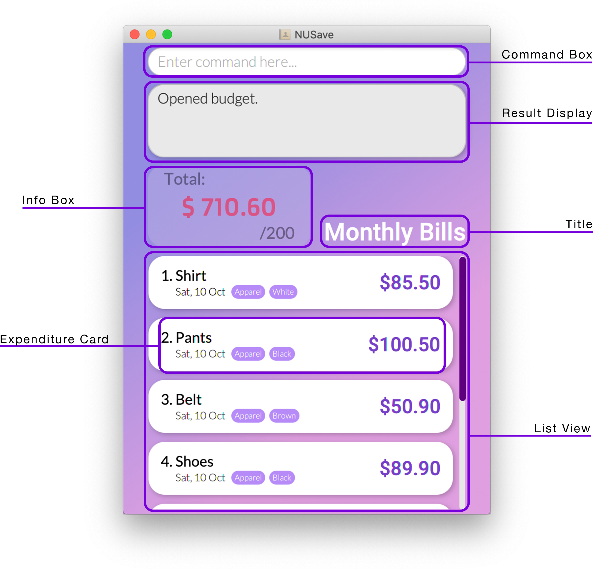

Figure 3.2.1. Example of a budget page view.

Below is a table containing all the components that can be found on a budget page accompanied by their respective purposes:

Component | Purpose
--------- | -------
Command Box | A text field for you to enter your desired commands.
Result Display | A **scrollable** panel that displays the response messages of a command after it has been executed.
Info Box | A panel that displays the total amount you have spent so far based on the expenditures added to the budget. It will also display the threshold of the budget if it has one.
Title | A text field that displays the name of the budget that is currently open.
Expenditure Card | A card that represents an expenditure stored in the budget that is currently open. It contains the index, name, tags and price of the expenditure.
List View | A **scrollable** panel that can hold multiple expenditure cards.

Here is the breakdown of an individual expenditure card:

Figure 3.2.2. Example of an expenditure card.

Below is a table containing all the components that can be found in an expenditure card accompanied by their respective purposes:

Component     | Purpose
------------- | -------
Index         | The index used to reference this expenditure.
Name          | The name of this expenditure.
Creation Date | The date at which this expenditure is added.
Tags          | The tags that this expenditure has been assigned.
Price         | The price of this expenditure.

## 4. Quick Start
(Contributed by Wen Hao)

If this is your first time using NUSave, follow these simple steps to jump straight into the action:

1. Ensure that you have Java `11` or above installed in your computer.

2. Download the latest `NUSave.jar` from [here](https://github.com/AY2021S1-CS2103T-T11-4/tp/releases).

3. Copy the file to the folder you want to use as the *home folder* for NUSave.

4. Double-click the file to start the application. A GUI similar to [Figure 3.1.1](#31-main-page-view) should appear in a few seconds.

> 📕 If the application does not start after double-clicking the file, you can troubleshoot by doing the following:
>
> <ins>For Windows <a href="#7-glossary">OS</a> users:</ins>
> 1. Launch [command prompt](#7-glossary) and navigate to the path of the home folder for NUSave.
> 2. Enter the following command: `java -jar nusave.jar` as seen in Figure 4.1 below:
>
> 
>
> Figure 4.1. Example of launching NUSave using command prompt.
>
> <ins>For Mac OS users:</ins>
> 1. Launch [terminal](#7-glossary) and navigate to the path of the home folder for NUSave.
> 2. Enter the following command: `java -jar nusave.jar` as seen in Figure 4.2 below:
>
> 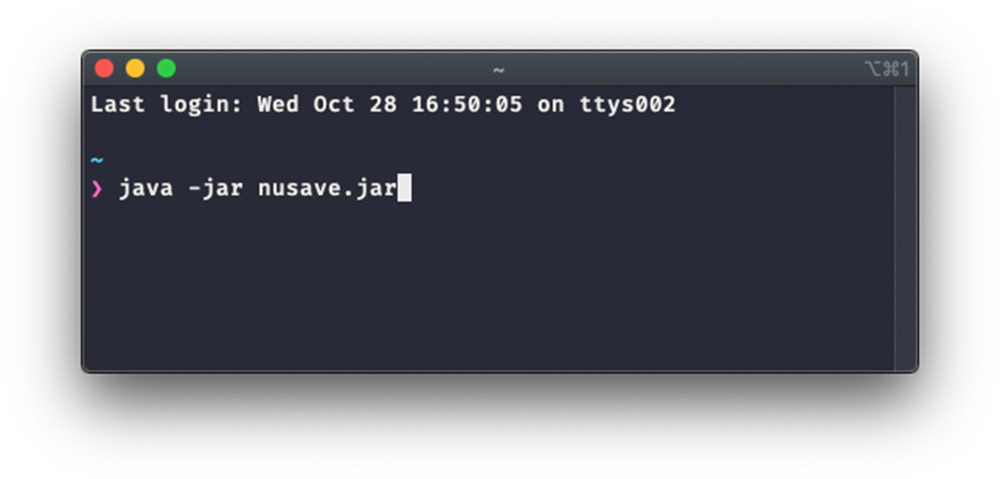
>
> Figure 4.2. Example of launching NUSave using terminal.

5. Congratulations, you have successfully launched NUSave!
> 📕 If you are launching the application for the first time, a set of sample data will be created for you.
> Use the [clear command](#527-clearing-budgets-clear) to purge any existing sample data.

6. Type your desired command into the command box and press the enter button to execute it. Below is a series of commands that you can try:
    - `create n/Daily Expenses`: Creates a budget with the name "Daily Expenses".
    - `open 1`: Opens the budget located at index 1.
    - `close`: Closes the budget that is open and return to the main page.
    - `help`: Shows the list of commands currently available.
    - `exit`: Exits the app.

7. Refer to the [commands section](#5-commands) below for the details of each command.

## 5. Commands

In this section, you will learn about the commands that are available in NUSave and how to use them.

### 5.1. Universal commands

The following commands in this subsection are available on any pages.

#### 5.1.1. Viewing help: `help`
(Contributed by Yu Ming)

Format: `help`

You can use this command to view a list of commands that are currently available.

✏️ Example: `help`

This will cause the details of each available command along with its syntax to appear on the result display
as seen in Figure 5.1.1.1 below:

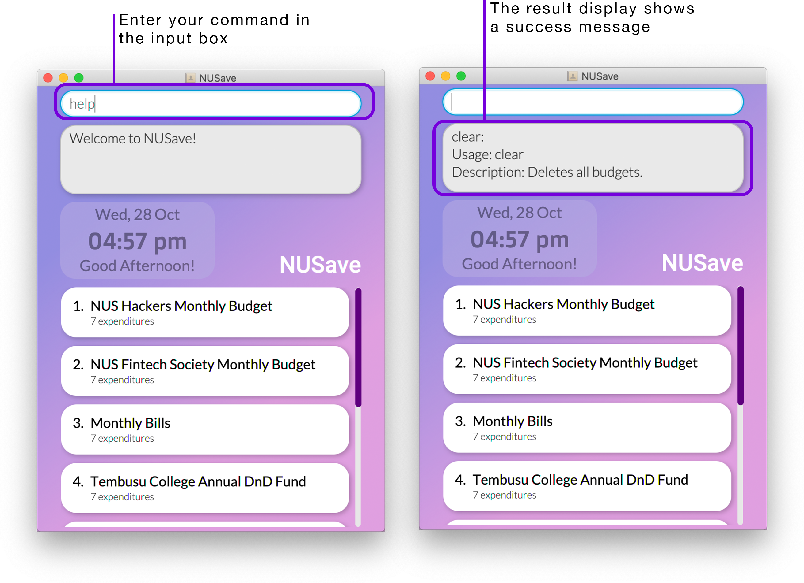

Figure 5.1.1.1. Example of using the help command on the main page.

#### 5.1.2. Undoing a command: `undo`
(Contributed by Wen Hao)

Format: `undo`

You can use this command to undo a previously executed command.

> 📕 You can only undo the following commands:
> * [`create` budget command](#521-creating-a-budget-create)
> * [`delete` budget command](#522-deleting-a-budget-delete)
> * [`edit` budget command](#523-editing-a-budget-edit)
> * [`clear` budget command](#527-clearing-budgets-clear)
> * [`add` expenditure command](#531-adding-an-expenditure-add)
> * [`delete` expenditure command](#532-deleting-an-expenditure-delete)
> * [`edit` expenditure command](#533-editing-an-expenditure-edit)

✏️ Example: `undo`

This will cause NUSave to revert to its state before the previous command was executed as seen in Figure 5.1.2.1 below:

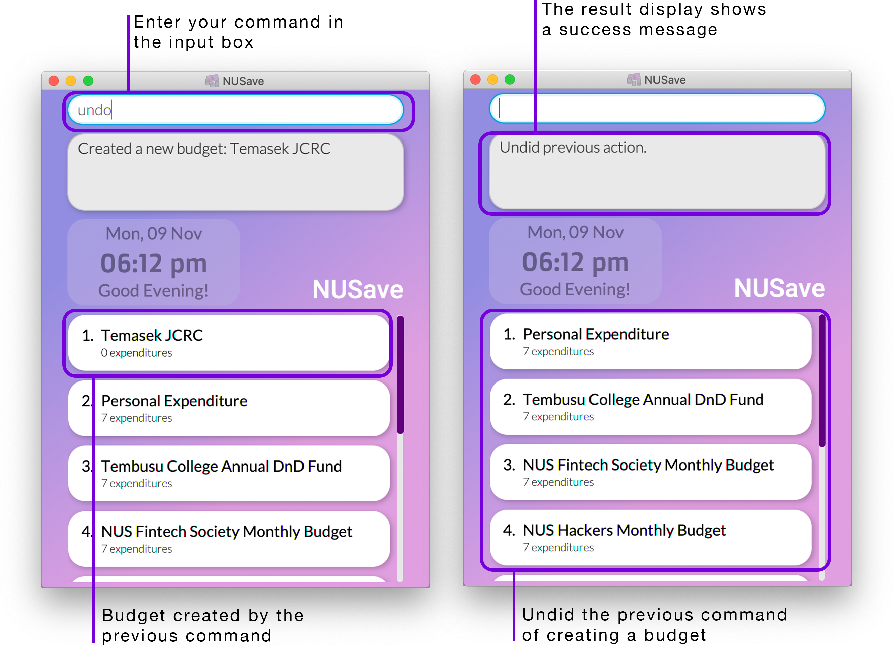

Figure 5.1.2.1. Example of using the undo command on the main page.

#### 5.1.3. Redoing a command: `redo`
(Contributed by Wen Hao)

Format: `redo`

You can use this command to redo a previously undone command.

✏️ Example: `undo`

This will cause NUSave to revert to its state after the executing the previously undone command as seen in Figure 5.1.3.1 below:

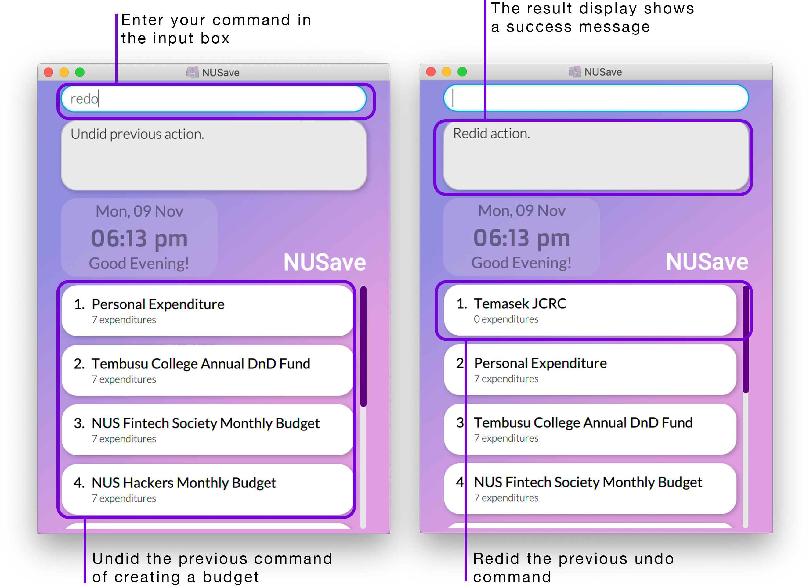

Figure 5.1.3.1. Example of using the redo command on the main page.

#### 5.1.4. Exiting NUSave: `exit`
(Contributed by David)

Format: `exit`

You can use this command to exit from the application.

✏️ Example: `exit`

This will exit the application.

### 5.2. Main page commands

The following commands in this subsection are only available on the main page.

#### 5.2.1. Creating a budget: `create`
(Contributed by Yu Ming)

Format: `create n/NAME [p/THRESHOLD]`

Prefix | Parameters | Requirement | Comments                        | Constraints                           |
------ | ---------- | ----------- | ------------------------------- | ------------------------------------- |
 n/    | `NAME`     | Required    | Name of the budget              | Limited to a maximum of 50 characters |
 p/    | `THRESHOLD`| Optional    | Target threshold of the budget  | Must be a positive value less than $1,000,000 |

You can use this command to create a new budget with the given `NAME` and `THRESHOLD`.

When you create a new budget, it will be displayed as a budget card in the list view.

> 📕 You can create a budget with no threshold to simply track your total expenses.
>
> ⚠️ You can only create a maximum of 100 budgets.

✏️ Example: `create n/Temasek Hall Student Council p/1200`

This will create a new budget called "Temasek Hall Student Council" with a threshold value of $1200
as seen in Figure 5.2.1.1 below:

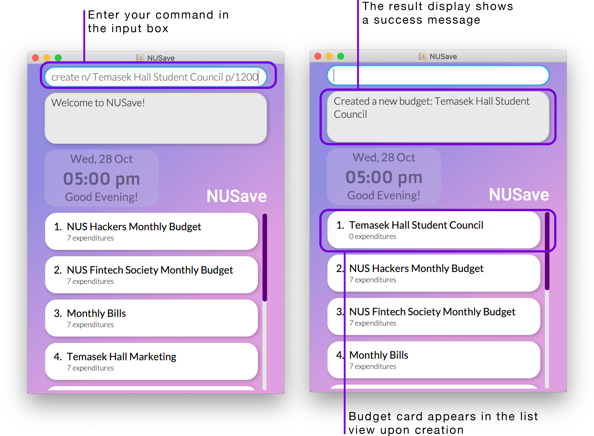

Figure 5.2.1.1. Example of using the create budget command.

#### 5.2.2. Deleting a budget: `delete`
(Contributed by David)

Format: `delete INDEX`

Prefix | Parameters | Requirement | Comments                          | Constraints |
------ | ---------- | ----------- | --------------------------------- | ----------- |
\-     | `INDEX`    | Required    | Index of the budget to be deleted | Must be between 1-100 since there can only be a maximum of 100 budgets |

You can use this command to delete the budget at the given `INDEX`.

When you delete a budget, its budget card will be removed from the list view.

✏️ Example: `delete 1`

This will delete the budget at index 1 as seen in Figure 5.2.2.1 below:

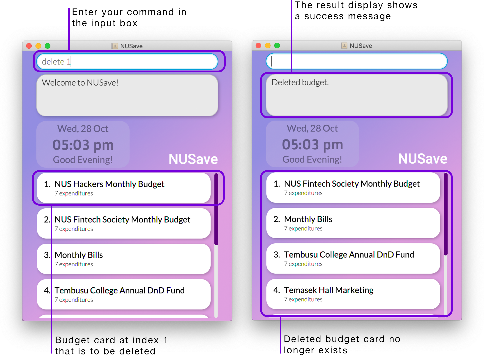

Figure 5.2.2.1. Example of using the delete budget command.

#### 5.2.3. Editing a budget: `edit`
(Contributed by Yu Ming)

Format: `edit INDEX [n/NAME] [p/THRESHOLD]`

Prefix | Parameters | Requirement | Comments | Constraints |
-------| ---------- | ----------- | -------- | ----------- |
 \-    | `INDEX`    | Required    | Index of the budget to be edited | Must be between 1-100 since there can only be a maximum of 100 budgets |
 n/    | `NAME`     | Optional    | Name of the budget to be edited to | Limited to a maximum of 50 characters |
 p/    | `THRESHOLD`| Optional    | Threshold of the budget to be edited to | Must be a positive value less than $1,000,000 |

You can use this command to edit the budget at the given `INDEX`.

When you edit a budget, the information on its budget card will be updated immediately.

 > ⚠️ Although both `NAME` and `THRESHOLD` fields are optional, the command must include at least one of these prefixes.

✏️ Example: `edit 2 n/NUS Computing Club`

This will rename the budget at index 2 to "NUS Computing Club" as seen in Figure 5.2.3.1 below:

Figure 5.2.3.1. Example of using the edit budget command.

#### 5.2.4. Finding budgets: `find`
(Contributed by Chin Hui)

Format: `find KEYWORD`

 Prefix | Parameters | Requirement | Comments | Constraints |
 ------ | ---------- | ----------- | -------- | ----------- |
 \-     |  `KEYWORD` | Required    | Keyword to be used for searching | \- |

You can use this command to find budgets whose names contain the given `KEYWORD`.

When you find budgets, the list view will filter to only display budgets whose names contains the given `KEYWORD`.

 > 📕 The filter is case-insensitive.
 >
 > 📕 If no budgets are displayed, it means that none of the budgets matches your search term. 
 > 
 > 📕 You can use the [list budgets command](#525-listing-budgets-list) to display all budgets again.

✏️ Example: `find Temasek Hall`

This will find all budgets with the keyword 'Temasek Hall' in the name of the budget as seen in Figure 5.2.4.1 below:

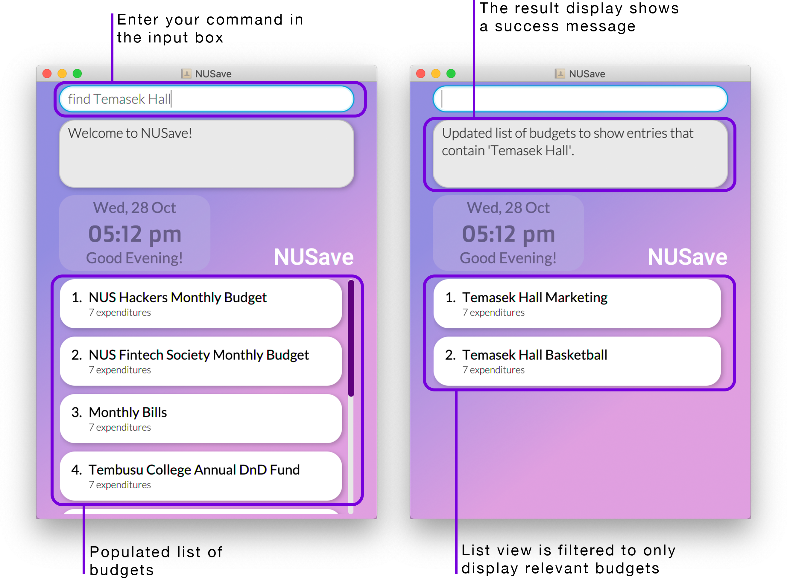

Figure 5.2.4.1. Example of using the find budgets command.

#### 5.2.5. Listing budgets: `list`
(Contributed by Chin Hui)

Format: `list`

You can use this command to display all budgets.

When you list budgets, the list view will display all budgets that are stored in NUSave.

 > 📕 This command is usually used after using the [find budgets command](#524-finding-budgets-find).

✏️ Example: `list`

This will display all budgets that are currently stored in NUSave as seen in Figure 5.2.5.1 below:

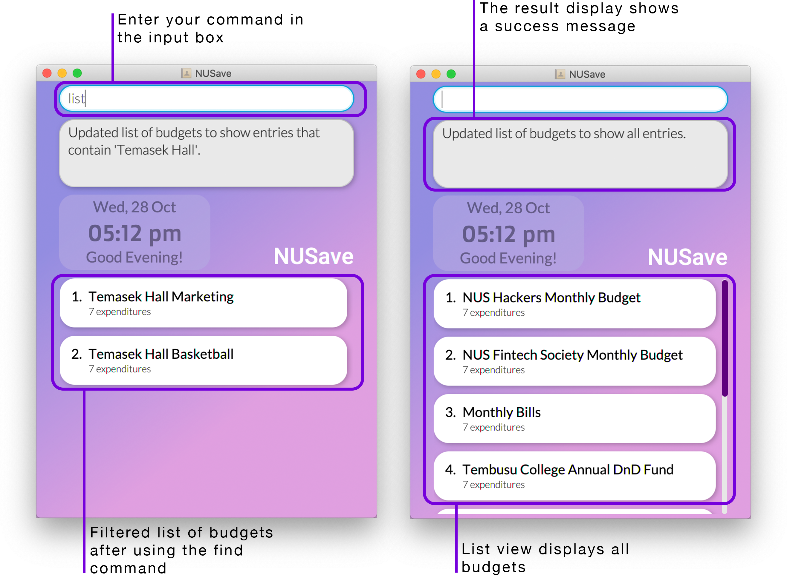

Figure 5.2.5.1. Example of using the list budgets command.

#### 5.2.6. Sorting budgets: `sort`
(Contributed by Yu Ming)

Format: `sort TYPE`

 Prefix | Parameters | Requirement | Comments | Constraints |
 ------ |----------- | ----------- | -------- | ----------- |
 \-     | `TYPE`     |   Required  | Can be either `time` or `name` | \- |

You can use this command to sort your budgets by the given `TYPE`.

There are two ways you can sort your budgets:

- By their creation date with the most recently created budget at the top.
    
- By their name in alphabetical order.

> 📕 Newly created budgets will still appear at the top of the [list view](#3-gui-layout).

✏️ Example: `sort name`

This will sort the budgets (that are currently displayed) by their name in alphabetical order as seen in Figure 5.2.6.1 below:

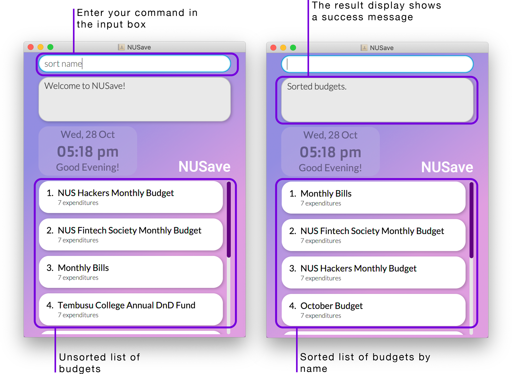

Figure 5.2.6.1. Example of using the sort budgets command.

#### 5.2.7. Clearing budgets: `clear`
(Contributed by Wen Hao)

Format: `clear`

You can use this command to delete all existing budgets.

> 📕 This command is usually used to purge the sample data that is created when you launch the application for the first time.

✏️ Example: `clear`

This will delete all budgets that are currently stored in NUSave as seen in Figure 5.2.7.1 below:

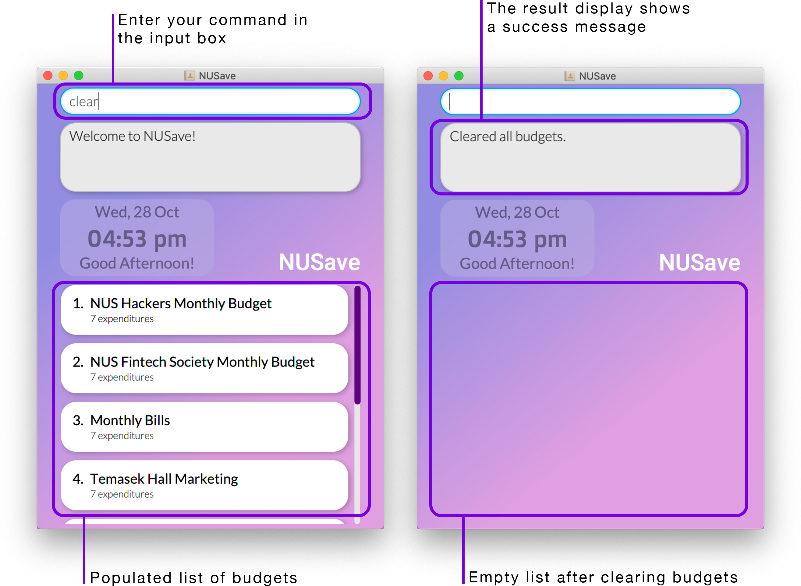

Figure 5.2.7.1. Example of using the clear budgets command.

#### 5.2.8. Opening a budget: `open`
(Contributed by Song Yu)

Format: `open INDEX`

 Prefix | Parameters | Requirement | Comments | Constraints |
 ------ | ---------- | ----------- | -------- | ----------- |
 \-     | `INDEX`    | Required    | Index of the budget to be opened | Must be between 1-100 since there can only be a maximum of 100 budgets |

You can use this command to open the budget at the given `INDEX`.

When you open a budget, you will be directed to its budget page.

✏️ Example: `open 1`

This will open the budget at index 1 as seen in Figure 5.2.8.1 below:

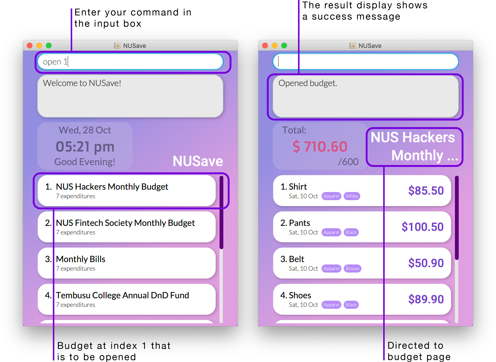

Figure 5.2.8.1 Example of using the open budget command.

### 5.3. Budget page commands

The following commands in this subsection are only available on the budget page.

#### 5.3.1. Adding an expenditure: `add`

(Contributed by Song Yu)

Format: `add n/NAME p/PRICE [t/TAG]`

Prefix | Parameters | Requirement | Comments | Constraints |
-------| -----------| ------------| -------- | ----------- |
 n/    | NAME       | Required    | Name of the expenditure | Limited to a maximum of 50 characters |
 p/    | PRICE      | Required    | Price of the expenditure | Must be a positive value that is less than $10,000 |
 t/    | TAG        | Optional    | Additional information about the expenditure | Limited to a maximum of 15 characters and a total of 3 tags |

You can use this command to add a new expenditure with the given `PRICE` and optional `TAG` within a budget.

> ⚠️ You can add a maximum of 100 expenditures.

When you add a new expenditure, it will be displayed as an expenditure card in the list view.
 
✏️ Example: `add n/Graphic Calculator p/199.90 t/Math`

This will add a new expenditure called "Graphic Calculator" with a price of $199.90 and a "Math" tag as seen in 
Figure 5.3.1.1. below:

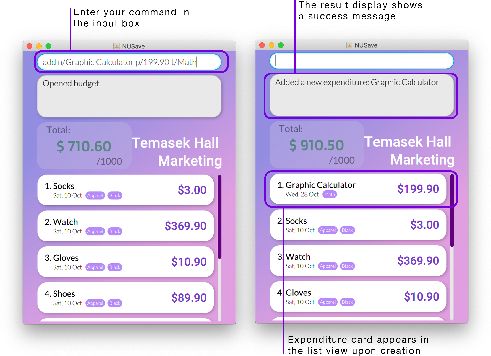

Figure 5.3.1.1. Example of using the add expenditure command.

#### 5.3.2. Deleting an expenditure: `delete`
(Contributed by David)

Format: `delete INDEX`

 Parameters | Requirement | Comments | Constraints |
 -----------| ------------| -------- | ----------- |
Index | Required | Index of the expenditure | Must be between 1-100 since there can only be a maximum of 100 expenditures |

You can use this command to delete the expenditure at the given `INDEX`.

When you delete an expenditure, its expenditure card will be removed from the list view.

✏️ Example: `delete 2`

This will delete the budget at index 2 as seen in Figure 5.3.2.1 below:

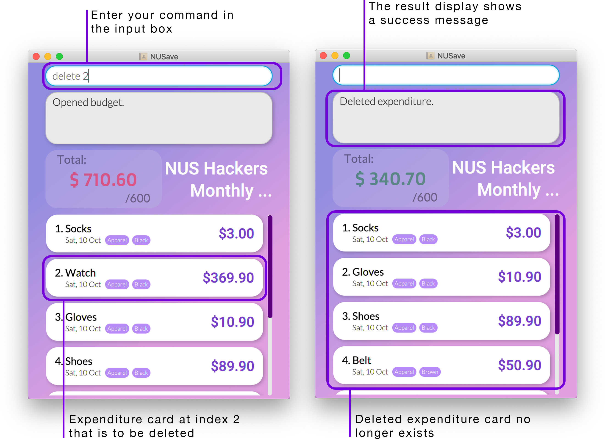

Figure 5.3.2.1. Example of delete expenditure command

#### 5.3.3. Editing an expenditure: `edit`
(Contributed by David)

Format: `edit INDEX [n/NAME] [p/PRICE]`

Prefix | Parameters | Requirement | Comments | Constraints |
------ | ---------- | ----------- | -------- | ----------- |
\-     | `INDEX`    | Required    | Index of the expenditure displayed on NUSave | Must be between 1-100 since there can only be a maximum of 100 expenditures |
 n/    | `NAME`     | Optional    | Name of the expenditure to be edited to | Limited to a maximum of 50 characters |
 p/    | `PRICE`    | Optional    | Price of the expenditure to be edited to | Must be a positive value that is less than $10,000 |
 t/    | `TAG`      | Optional    | Tags of the expenditure to be edited to | Limited to a maximum of 15 characters and a total of 3 tags |

You can use this command to edit the expenditure at the given `INDEX`.

When you edit a expenditure, the information on its expenditure card will be updated immediately.

 > ⚠️ Although both `NAME` and `PRICE` fields are optional, the command must include at least one of these prefixes.

✏️ Example: `edit 1 n/Long Sleeve Shirt p/20`

This will rename the expenditure at index 2 to "Long Sleeve Shirt" with price "$20" as seen in Figure 5.3.3.1 below:

Figure 5.3.3.1. Example of edit expenditure command

#### 5.3.4. Finding expenditures: `find`
(Contributed by Chin Hui)

Format: `find KEYWORD`

Prefix | Parameters | Requirement | Comments | Constraints |
-------| ---------- | ----------- | -------- | ----------- |
\-     | `KEYWORD`     | Required    | Keyword / Keyphrase to be searched | \- |

You can use this command to find expenditures in the current budget whose names contain the given `KEYWORD`. 

When you find expenditures, the list view will filter to only display expenditures whose names contains the given `KEYWORD`.

 > 📕 The filter is case-insensitive.
 >
 > 📕 If no expenditures are displayed, it means that none of the expenditures matches your search term. 
 >
 > 📕 You can use the [list expenditures command](#535-listing-expenditures-list) to display all expenditures again.

✏️ Example: `find sock`

This will find all expenditures with the keyword 'sock' in the name of the expenditure as seen in Figure 5.3.4.1 below:

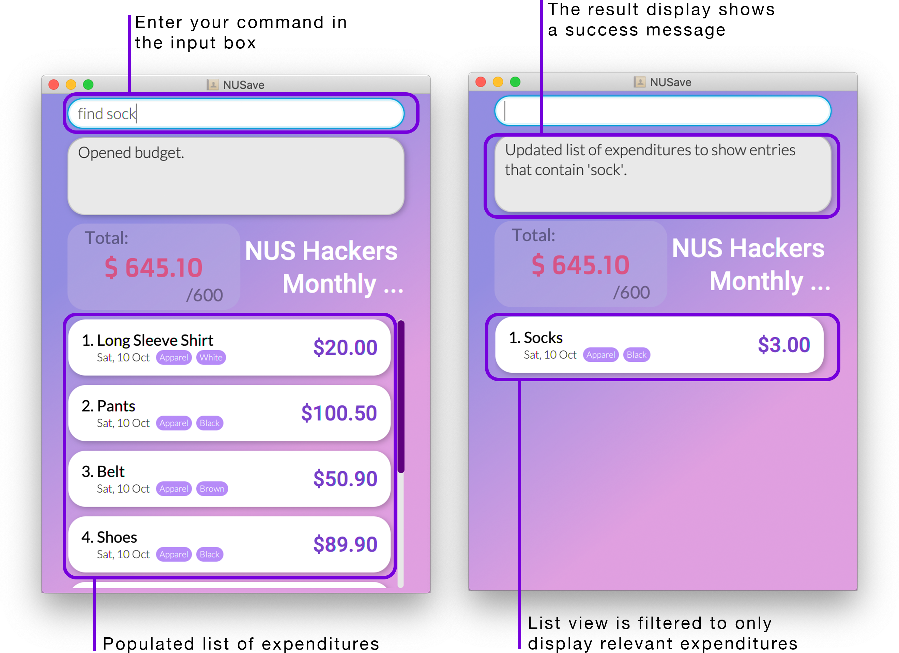

Figure 5.3.4.1. Example of using the find expenditures command.

#### 5.3.5. Listing expenditures: `list`
(Contributed by Chin Hui)

Format: `list`

You can use this command to list all expenditures in the current budget.

When you list expenditures, the list view will display all expenditures belonging to the budget that is currently open.

 > 📕 This command is usually used after using the [find expenditure command](#534-finding-expenditures-find).

✏️ Example: `list`

This will display all existing expenditures in the current budget as seen in Figure 5.3.5.1 below:

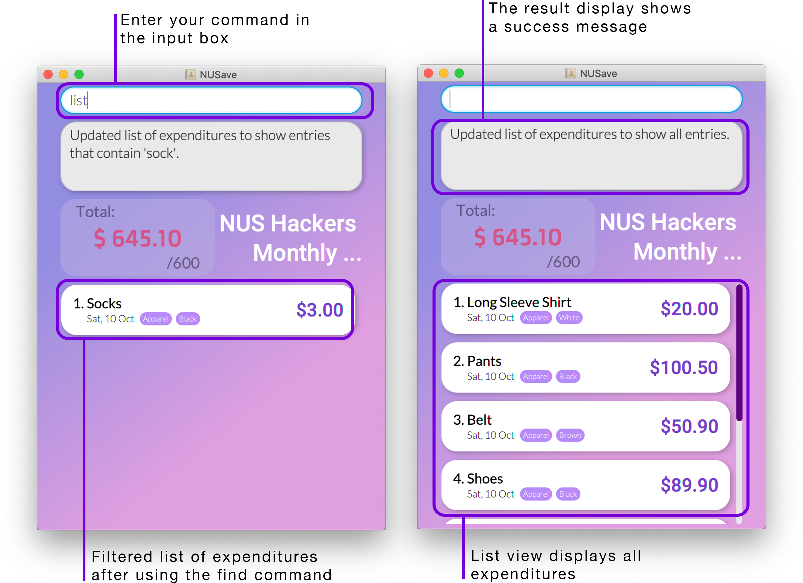

Figure 5.3.5.1. Example of using the list expenditures command.

#### 5.3.6. Sorting expenditures: `sort`
(Contributed by Yu Ming)

Format: `sort TYPE`

 Parameters | Requirement | Comments | Constraints |
 ---------- | ----------- | -------- | ----------- |
 `TYPE`     | Required    | Types of sort: `time`, `name` | \- |

You can use this command to sort your expenditures (within a budget) by the given `TYPE`.

There are two ways you can sort your expenditures:

- By their creation date with the most recently created budget at the top.
    
- By their name in alphabetical order.

> 📕 Newly created expenditures will still be added to the top.

✏️ Example: `sort name`

This will sort the expenditures (that are currently displayed) by their name in alphabetical order as seen in Figure 5.3.6.1 below:

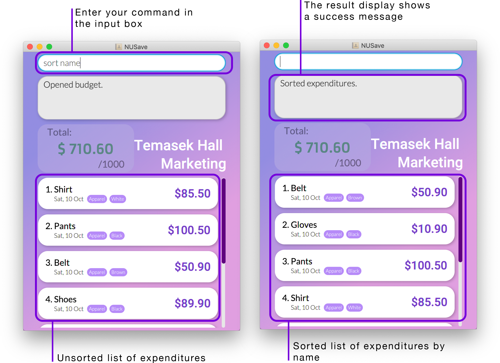

Figure 5.3.6.1. Example of using the sort expenditures command.

#### 5.3.7. Closing a budget: `close`
(Contributed by Song Yu)

Format: `close`

You can use this command to close a budget.

By closing a budget, you will now be directed to the main page.

✏️ Example: `close`

This will close the current budget as seen in Figure 5.3.7.1 below:

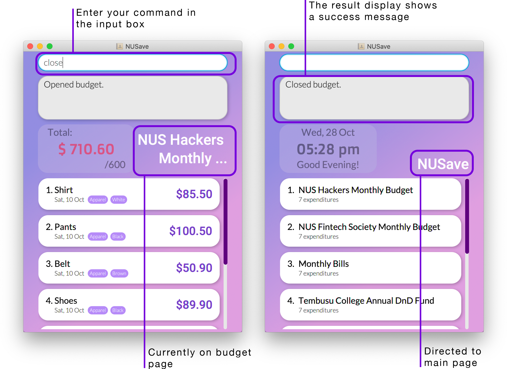

Figure 5.3.7.1. Example of using the close budget command.

## 6. Command Summary
(Contributed by Yu Ming)

### 6.1. Universal commands

| **Action**        | **Format** | **Examples** 
|------------------ |------------|--------------
| View help      | `help`     | \-           
| Undo a command | `undo`     | \-         
| Redo a command | `redo`     | \-         
| Exit NUSave    | `exit`     | \-           

### 6.2. Main page commands

| **Action**        | **Format**                          | **Examples**                                                     
|-------------------|-------------------------------------|------------------------------------------------------------------
| Create a budget   | `create n/NAME [p/THRESHOLD]`       | `create n/Daily Expenses`,  `create n/Project Work p/100`     
| Delete a budget   | `delete INDEX`                      | `delete 1`                                                       
| Edit a budget     | `edit INDEX [n/NAME] [p/THRESHOLD]` | `edit 1 n/Hall Council`,  `edit 2 n/NUS Computing Club p/1000`
| Find budgets      | `find KEYWORD`                      | `find Temasek`                                        
| List all budgets  | `list`                              | \-                                                               
| Sort all budgets  | `sort TYPE`                         | `sort time`,  `sort name`                                     
| Clear all budgets | `clear`                             | \-                                                               
| Open a budget     | `open INDEX`                        | `open 1`                                                         

### 6.3. Budget page commands

| **Action**            | **Format**                      | **Examples**                                           
|-----------------------|---------------------------------|--------------------------------------------------------
| Add an expenditure    | `add n/NAME p/PRICE [t/TAG]`    | `add n/TShirt p/20`,  `add n/Breakfast p/10 t/food` 
| Delete an expenditure | `delete INDEX`                  | `delete 1`                                             
| Edit an expenditure   | `edit INDEX [n/NAME] [p/PRICE]` | `edit 2 n/NikeShirt`,   `edit 2 p/28`               
| Find expenditures     | `find KEYWORD`                  | `find shirt`                                           
| List all expenditures | `list`                          | \-                                                     
| Sort all expenditures | `sort TYPE`                     | `sort time`,  `sort name`                           
| Close a budget        | `close`                         | \-                                                     

## 7. Glossary  
(Contributed by Song Yu)

You can find the meanings of some special keywords applicable to NUSave over here.

| Term                        | Explanation                                                                                                                                                                    
|---------------------------- |-----------------------------------------------------------------------------------------------------------------------------------
| CLI                         | Short for **Command Line Interface**. CLI-based Applications (i.e. NUSave) focuses on processing commands in the form of text entered from the keyboard.                       
| GUI                         | Short for **Graphical User Interface**. GUIs work as the communication channel between the program and the user. Users interact with NUSave through the GUI, on their devices. 
| OS                          | Short for **Operating Systems**. The underlying computer program that allows users to interact with a computer. It manages the hardware components and software resources of a computer for the user.           
| Command Prompt (Windows OS) | A CLI application proprietary to Windows OS devices, where users can run commands on a Windows device by entering typed commands.                                              
| Terminal (Mac OS)           | A CLI application proprietary to Mac OS devices, where users can run commands on a Mac device by entering typed commands.                                                      
| Expenditure                 | Refers to a single item to be recorded in NUSave.                                                                                                                              
| Budget                      | Refers to how NUSave stores related expenditures under one group. A budget can also hold additional information about this list of expenditures, such as the target limit of what is to be spent (i.e. threshold). 
| Main Page                   | Refers to the page that displays the list of budgets that is stored in NUSave.                                                                                                 
| Budget Page                 | Refers to the page that displays the list of expenditures belonging in a specific budget that is stored in NUSave.                                                             
| Threshold                   | Refers to the target limit that can be spent in that budget.

## 8. FAQ
(Contributed by Chin Hui)

**Q**: How do I transfer my data to another computer?

**A**: Install the application on another computer and overwrite the empty data file it creates with the .json file that contains the data of your previous NUSave folder.

**Q**: Where is my save data stored?

**A**: They are stored in the `data` folder where the NUSave application is found.

**Q**: How do I make backups of my data in NUSave?

**A**: You can copy and paste the `data` folder located in the NUSave home folder to somewhere safe and easy to remember. To restore the backup, copy the entire folder back into the same home folder and overwrite the existing folder.

**Q**: How do I delete all my data in NUSave?

**A**: You can delete the `data` folder in the NUSave home folder.

**Q**: Will my data be compromised?

**A**: Don't worry! All data in NUSave is stored on your local device and will not be transferred over the web.

**Q**: Does this application require an internet connection to run?

**A**: NUSave does not access any web services and can be run completely offline.

