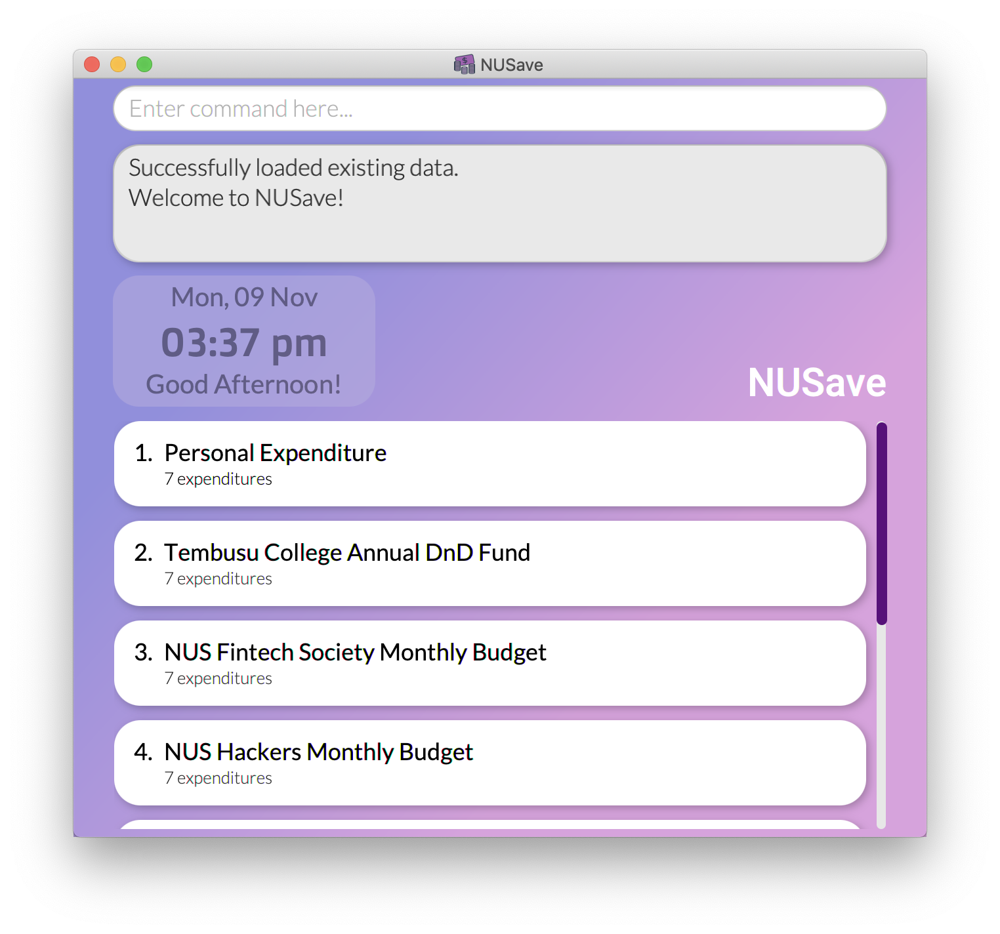

Are you a **university student who stays on campus** and has difficulty managing your expenses?
Are you tired of having to look through countless spreadsheets and memos just to figure out how much you have spent this month?
Do you wish there exists a desktop application that can help you organise, track and manage all your expenses?

Look no further, NUSave is just the tool for you!

Built by 5 university students staying on campus, we understand **the difficulties of having to manage multiple budgets**,
be it for your daily expenses, school projects or club activities, amidst your busy schedule. NUSave aims to help alleviate
the hassle that comes along with managing multiple budgets by providing a **one-stop solution** to all your problems.

With NUSave, you can **create, edit and delete [budgets](#7-glossary) and [expenditures](#7-glossary)**, as well as **generate statistics
based on your entries** to gain useful insights regarding your spending habits.

What's more, NUSave has:
- a **[Command Line Interface (CLI)](#7-glossary)** catered to those who can type fast and prefer to use a keyboard. In other words, you
navigate the application and execute instructions by keying in text-based commands into the [command box](#3-gui-layout) provided.
- a **[Graphical User Interface (GUI)](#7-glossary)** to provide you with a visually appealing and aesthetic user experience. Essentially,
the current status of the application is reflected live on-screen so what you see is what you get!

If you are interested in using NUSave, head over to the [_Quick Start_ section of the **User Guide**](UserGuide.html#quick-start).

If you are interested about developing NUSave, the [**Developer Guide**](DeveloperGuide.html) is a good place to start.

**Acknowledgements**

* Libraries used: [JavaFX](https://openjfx.io/), [Jackson](https://github.com/FasterXML/jackson), [JUnit5](https://github.com/junit-team/junit5)
