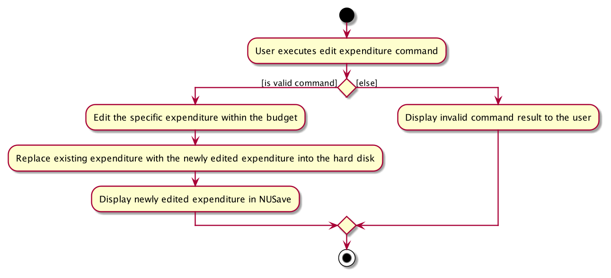
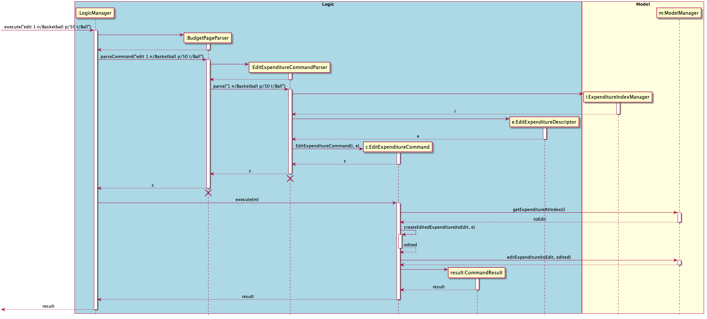
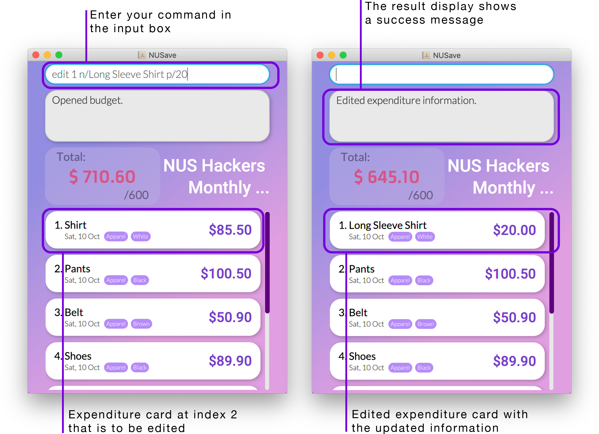

## Project: NUSave
NUSave is a desktop budgeting application used to manage an individual's budgets and expenses. NUSave can hold multiple 
budgets, of which each budget holds multiple expenditures. The user interacts with it using a command line interface 
(CLI), and it has a GUI created with JavaFX. It is written in Java, and has about 10,000 LoC.

Given below are my contributions to the project:
- **Feature**: Added ability to delete budgets.
    - What it does: `delete` allows for users to delete specific budgets, when it is no longer necessary or when they 
    have made a wrong budget.
    - Justification: This feature allows for the application to not become overly cluttered with unused budgets, and 
    improves the overall neatness of the interface.
- **Feature**: Added ability to delete expenditures.
    - What it does: `delete` Allows for users to delete specific expenditures, when it is no longer necessary or when they have 
    input a wrong expenditure.
    - Justification: The feature allows for individual budgets to only have the relevant expenditures, and improve the 
    overall neatness of the interface
- **Feature**: Added ability to edit expenditures.
    - What it does: allows for users to edit expenditures of the specific index, granting them the ability to change,
    the name, price and tag of an expenditure
    - Justification: Improves the app significantly saving the users time in not having to delete and recreate an
    expenditure when there is a field to change.
    - Highlight: Users are able to choose multiple fields that they wish to edit at one go, the challenge was to be able
    to enable different combinations of field they wish to edit while still being able to detect when no fields have been
    added.
- **Code Contributed**: [RepoSense Link](https://nus-cs2103-ay2021s1.github.io/tp-dashboard/#breakdown=true&search=&sort=groupTitle&sortWithin=title&since=2020-08-14&timeframe=commit&mergegroup=&groupSelect=groupByRepos&checkedFileTypes=docs~functional-code~test-code~other&tabOpen=true&tabType=zoom&zA=davidliew9&zR=AY2021S1-CS2103T-T11-4%2Ftp%5Bmaster%5D&zACS=261.9682120869456&zS=2020-08-14&zFS=&zU=2020-11-07&zMG=false&zFTF=commit&zFGS=groupByRepos&zFR=false)
- **Project Management**:
    - Identified and created Issues in milestones v1.2, v1.3
    - [PRs reviewed by me](https://github.com/AY2021S1-CS2103T-T11-4/tp/pulls?q=is%3Apr+reviewed-by%3Adavidliew9)
 
 
 
 
 
 
- **Contributions to Documentation**:
    - User Guide:
        - Added documentation for the commands `delete budget`, `delete expenditure`, `edit expenditure`,`exit`.
    - Developer Guide:
        - Added documentation for introduction, use cases.
        - Added preface for `Add Commands`, `Delete Commands`, `Edit Commands`.
        - Added Sequence Diagrams for `Edit Expenditure`, `Add Expenditure`, `Delete Budget`, `Delete Expenditure`.
        - Added Activity Diagrams for `Edit Expenditure`, `Add Expenditure`, `Delete Budget`, `Delete Expenditure`.
        - Added Implementation details for `Edit Expenditure`, `Add Expenditure`, `Delete Budget`, `Delete Expenditure`.  
- **Community**:
    - Reported bugs and suggestions for other teams during PE dry run [PED link](https://github.com/davidliew9/ped/issues)
    
------
**Contributions to Developer Guide (Extracts)**:
#### 4.3.3. Edit Commands

This section describes the details surrounding events at which users would wish to edit information from NUSave. 
Specifically, editing can happen in two areas; when a user wishes to edit a budget from the `Main Page`, or when a 
user wishes to edit an expenditure from a budget within the `Budget Page`.

##### 4.3.3.2. Edit Expenditure

This section explains the `Edit Expenditure Command`.

The following activity diagram to shows the events that occur when the user executes the `Edit Expenditure Command`.

 

Figure 4.3.2.2.1: Activity Diagram for edit expenditure command.

The following command results in the specified expenditure of the particular index to be edited within the 
`Budget Page`. As such, this command requires a compulsory index to specify the particular expenditure, along with a
field at which the user would like to edit (`NAME`, `PRICE`, `TAG`).

Only when the index is valid (within the range of existing expenditures), and the user provides at least one field to 
be edited, does the command execute successfully.

The following sequence diagram shows the interactions between the `Logic` and `Model` components of NUSave,
depicting a scenario where the user would like to edit the first expenditure on his/her list, and change the previous 
`NAME`, `PRICE` and `TAG` to `Basketball`, `50` and `Ball` accordingly.

Figure 4.3.3.2.1: Sequence diagram  for delete edit command in budget page view.

1. Beginning with the `LogicManager`, the `LogicManager` hands the given user input to the `BudgetPageParser` 
to be parsed.
2. The `BudgetPageParser` will identify the command given by the user and create an `EditExpenditureCommandParser`.
3. The `BudgetPageParser` will pass the user input into the newly created `EditExpenditureCommandParser`.
4. The `EditExpenditureCommandParser` will create an `ExpenditureIndex` with the given parameters **index**  from the
user input.
5. The `EditExpenditureCommandParser` will then create an `EditExpenditureDescriptor` with the given parameters of 
**name**, **price** and **tags**.
6. The `EditExpenditureCommandParser` will then create an `EditExpenditureCommand` with the `Expenditure Index` and 
`EditExpenditureDescriptor`.
7. The `EditExpenditureCommandParser` will then return the `EditExpenditureCommand` object back to the `LogicManager`.
8. `LogicManager` will now call the `execute` method in the `EditExpenditureCommand` object, with the `Model` as a 
parameter.
7. The `EditExpenditureCommand`'s `execute` method will now call the `editExpenditure` method of the existing 
`Model` object passed in and update the `Expenditure` with a new `Expenditure` object within NUSave.
8. The `EditExpenditureCommand` then returns a `CommandResult` indicating the successful editing of the 
`Expenditure`.

With the above sequence, an expenditure will be successfully edited by the user in his NUSave application, and it will 
be reflected on the user interface through the successful `CommandResult` and updated budget list.

-----
**Contributions to User Guide (Extracts)**:
#### 5.3.3. Editing an expenditure: `edit`

Format: `edit INDEX [n/NAME] [p/PRICE]`

Prefix | Parameters | Requirement | Comments
-------| -----------| ------------| ------
\-     | `INDEX`    | Required    | Index of the expenditure displayed on NUSave
 n/    | `NAME`     | Optional    | Name of the expenditure to be edited to
 p/    | `PRICE`    | Optional    | Price of the expenditure to be edited to

You can use this command to edit the expenditure at the given `INDEX`.

When you edit a expenditure, the information on its expenditure card will be updated immediately.

 > ⚠️ Although both `NAME` and `PRICE` fields are optional, the command must include at least one of these prefixes.

✏️ Example: `edit 1 n/Long Sleeve Shirt p/20`

This will rename the expenditure at index 2 to "Long Sleeve Shirt" with price "$20" as seen in Figure 5.3.3.1 below:

Figure 5.3.3.1. Example of edit expenditure command

-----
