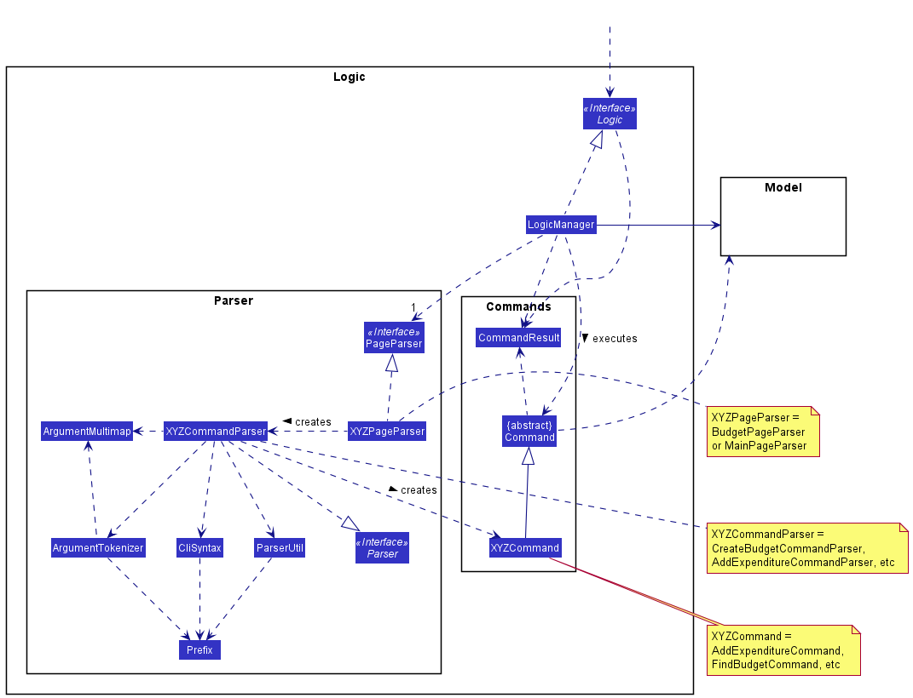
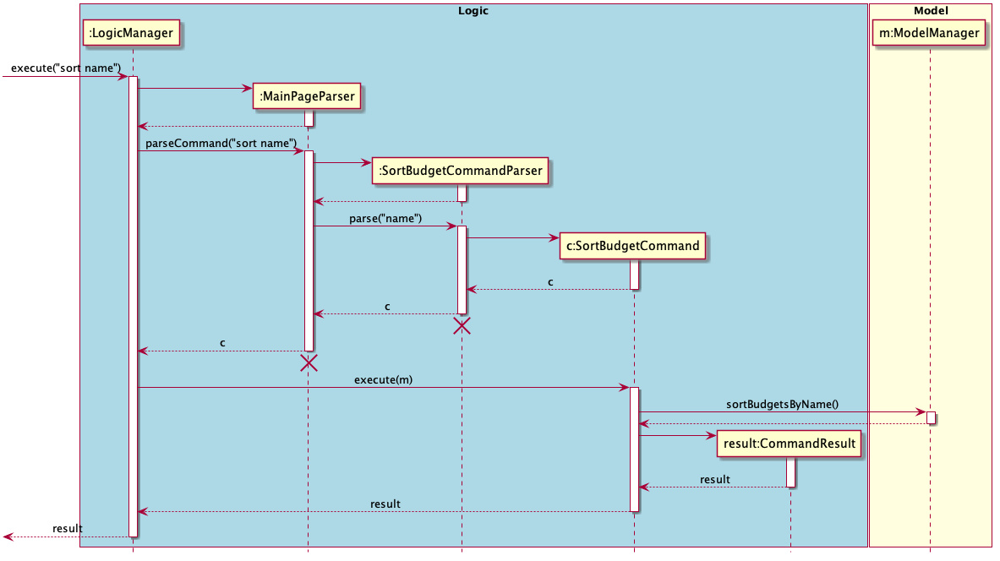
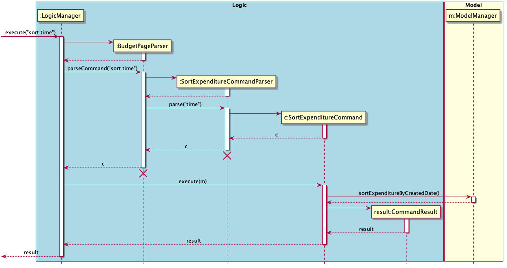

## Project: NUSave

NUSave is a desktop budgeting application used to manage an individual's budgets and expenses. NUSave can hold multiple
budgets, of which each budget holds multiple expenditures. The user interacts with it using a command line interface
(CLI), and it has a GUI created with JavaFX. It is written in Java, and has about 10,000 LoC.

Given below are my contributions to the project:
- **Feature** : Added ability to create budget in NUSave.
	- What it does: `create` allows the users to be able to create budgets, with its name and threshold value into
	NUSave.
	- Justification: This features allows users to be able to store budgets in the application, an essential component
	of NUSave. 
- **Feature** : Added ability to edit budget in NUSave.
	- What it does: `edit` allows the users to be able to edit a budget's name and threshold value in NUSave.
	- Justification: This features allows users to be able to edit a specific budget's name and threshold value in the
	application, an essential component of NUSave. 
- **Feature** : Added ability to view help in NUSave.
	- What it does: `help` allows the users to view the help commands in NUSave.
	- Justification: This features allows users to view all command help instructions in NUSave. 
	- Highlight: This feature displays a different set of help instructions depending on which page the user is on.
	For example, if user is on MAIN page, it will display unique command to the MAIN page such as `open` budget and
	`create` budget command. 
- **Feature** : Added ability to sort budgets in NUSave.
	- What it does: `sort` allows the users to be able to sort budgets in NUSave.
	- Justification: This features allows users to be able to sort all budgets in NUSave either by their name in 
	alphabetical order, or their created date with the latest on top.
	- Highlight: Not only is the sort budget command an executable command in NUSave. I have also implemented sort
	budget by created time upon launching of NUSave. This ensures NUSave is always sorted by created date upon launch
	independent of commands user used to reorder the budgets during the previous usage. The implementation is
	challenging as I need to find the most suitable place to execute the sort command upon launch, ensuring maximum
	efficiency while abiding by the principle of Object Oriented Programming.
- **Feature** : Added ability to sort expenditures in NUSave.
	- What it does: `sort` allows the users to be able to sort expenditures in NUSave.
	- Justification: This features allows users to be able to sort all expenditures in a budget either by their name in 
	alphabetical order, or their created date with the latest on top.
- **Feature** : Added ability dynamically view the current date and time in NUSave.
	- What it does: Dynamically updating the date and time in the MAIN page view UI component of NUSave.
	- Justification: This features allows users to be able to track the current date and time while managing their
	budget. 
	- Highlight: This enhancement affects UI component of NUSave by rendering current date and time. It required an
	in-depth analysis of the UI component in NUSave. It also generates unique greeting message to the user depending on
	the time of the day the user is using NUSave. The implementation too was challenging as it required the
	understanding and using of the java Thread class. 
	
- **Code Contributed**: [RepoSense Link](https://nus-cs2103-ay2021s1.github.io/tp-dashboard/#breakdown=true&search=&sort=groupTitle&sortWithin=title&since=2020-08-14&timeframe=commit&mergegroup=&groupSelect=groupByRepos&checkedFileTypes=docs~functional-code~test-code~other&tabOpen=true&tabType=authorship&tabAuthor=yu-ming-chen&tabRepo=AY2021S1-CS2103T-T11-4%2Ftp%5Bmaster%5D&authorshipIsMergeGroup=false&authorshipFileTypes=docs~functional-code~test-code~other)

- **Project Management**:
	- Created Issues in milestones v1.2, v1.3
	- [PRs reviewed by me](https://github.com/AY2021S1-CS2103T-T11-4/tp/pulls?q=is%3Apr+reviewed-by%3Ayu-ming-chen)

- **Enhancements to Existing Features**:
	- Added the ability for `edit` expenditure to edit expenditure tags: PR [#272](https://github.com/AY2021S1-CS2103T-T11-4/tp/pull/272)
	    - What it does: `edit` expenditure tags allows the users to be able to edit tags on expenditure in NUSave.
    	- Justification: This features allows users to be able to replace and change tags on specific expenditure in the
    	 application, an essential component of NUSave. 
    - Added NUSave icon to application UI interface: PR [#267](https://github.com/AY2021S1-CS2103T-T11-4/tp/pull/267)
        - What it does: Allow NUSave icon to be displayed in the application interface.
        - Justification: Improve visual effect for product differentiation. 

- **Contributions to Documentation**
	- User Guide:
		- Added documentation for `Symbols` and `Syntax format` section.
		- Added documentation for the features `help`, `create` budget, `edit` budget, `sort` budget and `sort`
		expenditures.
		- Added documentation for `Command summary` section.
		- Did cosmetic tweaks to existing documentation by including emoji for annotation.
		- Created and annotated all NUSave screenshots.
	- Developer Guide:
		- Added documentation for `Setting up`.
		- Added documentation for `Logic component` in Design Architecture.
		- Added implementation details for `Create Budget`, `Edit Budget`, `Sort` and `Help` command.

- **Community**:
	- Reported bugs and suggestions for other team (T) in the class during PE dry run (examples [T09-2 issues 116-141](https://github.com/yu-ming-chen/ped/issues)

- **Tools**:
  * Created UI mock up for our application using Figma [#21](https://github.com/AY2021S1-CS2103T-T11-4/tp/pull/21)

-------
- **Contributions to Developer Guide (Extracts)**:
#### 3.2.2. Logic Component
(Contributed by Yu Ming)

**API**: `Logic.java`

`Logic` uses the `MainPageParser` and `BudgetPageParser` class to parse the user command. This results in a
`Command` object which is executed by the `LogicManager`. The command execution can affect the `Model`
(e.g. adding an expenditure). The result of the command execution is encapsulated as a `CommandResult` object
which is passed back to the `Ui`. In addition, the `CommandResult` object can also instruct the `Ui` to perform
certain actions, such as displaying help to the user.

`MainPageParser`:
- Parse all the commands that is inputted by the user when the state of the NUSave is on `MAIN`.
- This includes commands such as `CreateBudgetCommand` and `OpenBudgetCommand` that are unique to execute at the MainPage.

`BudgetPageParser`:
- Parse all the commands that is inputted by the user when the state of the NUSave is on `BUDGET`.
- This includes commands such as `AddExpendtureCommand` and `CloseBudgetCommand` that are unique to execute at the BudgetPage.

`Commands`:
-  The `Logic` component includes all commands that is executable on both Main Page and Budget Page. For a complete
elaboration on what each command does, refer to [4.3. Commands](#43-commands).

The ***Sequence Diagram*** given above represents the interactions within the `Logic` component for the
`execute("delete 1")` API call to remove a budget in NUSave.

##### 4.3.1.1. Create Budget
(Contributed by Yu Ming)

This section explains the `Create Budget Command`.

The following activity diagram to shows the events that occur when the user executes the Create Budget Command.

 

Figure 4.3.1.1: Activity diagram for create budget command.

The following command occurs in the `Main Page` of NUSave, and results in the specified budget being created in
NUSave. This command therefore requires a compulsory name to specify the name of the budget to be created.

The following Sequence Diagram shows the interaction between the `Logic` component and `Model` component of NUSave 
depicting a scenario when the user wants to create a budget for his Temasek Hall basketball CCA by entering the command
`create n/Temasek Hall Basketball p/100`.

 

Figure 4.3.1.2: Sequence diagram for create budget command in main page view.
>Lifelines with a destroy marker (X) should end at the destroy marker (X) but due to a limitation of PlantUML, 
the lifeline reaches the end of diagram.

1. The `LogicManager` uses the `MainPageParser` to parse the given user input.
2. The `MainPageParser` will identify the command given by the user and pass the user input down to the
`CreateBudgetCommandParser`.
3. The `CreateBudgetCommandParser` will create a `Budget` with the given parameters **name** and **threshold** from the
user input.
4. The `CreateBudgetCommandParser` will then create a `CreateBudgetCommand` object with the created `Budget` object as
the input parameter.
5. The `CreateBudgetCommandParser` will then return a `CreateBudgetCommand` object.
6. `LogicManager` will now call the `execute` method in the `CreateBudgetCommand` object.
7. The `CreateBudgetCommand` will now call the `addBudget` method of the existing `Model` object and add the `Budget`
object created into NUSave.
8. The `CreateBudgetCommand` then returns a `CommandResult` indicating the successful addition of the `Budget` object.

With the above sequence, a budget will be successfully created by the user in his NUSave application, and it will be
reflected on the user interface.

#### 4.3.4. Sort Commands
(Contributed by Yu Ming)

This section explains the `Sort Command`.

The following activity diagram to shows the events that occur when the user executes the Sort Budget Command.

 

Figure 4.3.4.1: Activity diagram for sort budget command.

The following command can occur either in the `Main Page` or `Budget Page` of NUSave, and results in either the budgets
or the expenditures to be sorted by name or created date. As such, this command requires a compulsory `SortType` field
to specify the particular type of sorting required.

Only when the `SortType` is valid (`NAME` or `TIME`) does the command execute successfully.

The following sequence diagram shows the interactions between the `Logic` and `Model` components of NUSave,
depicting a scenario where the user would like to sort the budgets by thier name in alphabetical order. 

Figure 4.3.4.2: Sequence diagram for sort budget command in main page view.

>Lifelines with a destroy marker (X) should end at the destroy marker (X) but due to a limitation of PlantUML, 
the lifeline reaches the end of diagram.

1. Beginning with the `LogicManager`, the `LogicManager` hands the given user input to the `MainPageParser` 
to be parsed.
2. The `MainPageParser` will identify the command given by the user and create an `SortBudgetCommandParser`.
3. The `MainPageParser` will pass the user input into the newly created `SortBudgetCommandParser`.
4. The `SortBudgetCommandParser` will then create an `SortBugetCommand` with the sort type `NAME`
5. The `SortBudgetCommandParser` will then return the `SortBudgetCommand` object back to the `LogicManager`.
6. `LogicManager` will now call the `execute` method in the `SortBudgetCommand` object, with the `Model` as a 
parameter.
7. The `SortBudgetCommand`'s `execute` method will now call the `sortBudgetsByName` method of the existing 
`Model` and this will sort the list of budgets in NUSave according with the given sort type `NAME`.
8. The `SortBudgetCommand` then returns a `CommandResult` indicating the successful sorting of the 
`Budget` in NUSave by their name in alphabetical oredr.

With the above sequence, budgets will be successfully sorted by the user in his NUSave application by name in
alphabetical order, and it will be reflected on the user interface through the successful `CommandResult`
and updated budget list.

Note that the `sort` command can be executed on `Budget Page` view as well to sort the list of expenditures of a given
budget. The following sequence diagram shows the interactions between the `Logic` and `Model` components of NUSave,
depicting a scenario where the user would like to sort the expenditures by their created date with the lastest created
expenditure at the top of list of expenditures.

Figure 4.3.4.3: Sequence diagram for sort expenditure command in main page view.
>Lifelines with a destroy marker (X) should end at the destroy marker (X) but due to a limitation of PlantUML, 
the lifeline reaches the end of diagram.

The details of the flow of `SortExpenditureCommand` will not be elaborate in details as it is similiar to
`SortBudgetCommand`.
-------
- **Contributions to User Guide (Extracts)**:
## 2. About the User Guide

In this section, you will learn what the different symbols and notations (that can be found this in user guide) mean.

### 2.1. Symbols
(Contributed by Yu Ming)

When reading this user guide, various symbols may appear occasionally to draw your attention to important information.
The meaning for each symbol is as follows:

Symbol | Meaning 
-------| ------------ 
 ⚠️    | This symbol indicates that there is something important for you to take note of.
 📕    | This symbol indicates that there is additional information you may find useful.
 ✏️   | This symbol indicates that an example is provided.

### 2.2. Syntax format
(Contributed by Yu Ming)

The syntax of the commands in this user guide are to be interpreted in the following manner:

Format         | Meaning                | Examples 
-------------- | ---------------------- | ----
`lower_case/`  | **Prefix**             | `n/`, `p/`, `t/`
`UPPER_CASE`   | **Parameter**          | `NAME`, `THRESHOLD`, `PRICE`
`[UPPER_CASE]` | **Optional parameter** | `[p/THRESHOLD]`

> ⚠️ There **cannot be any spaces** within a prefix. For example, `n /` is an invalid prefix.
>
> ⚠️ If a parameter **does not have any prefixes**, it **must** be the **first parameter**.
> For example, `edit 1 n/NUS Computing Club p/1000` is a valid command but `edit n/NUS Computing Club p/1000 1` is an invalid command.
>
> 📕 Parameters with prefixes can be entered in **any order**.
> For example, `create n/Temasek Hall Student Council p/1200` is equivalent to `create p/1200 n/Temasek Hall Student Council`.

#### 5.2.1. Creating a budget: `create`
(Contributed by Yu Ming)

Format: `create n/NAME [p/THRESHOLD]`

Prefix | Parameters | Requirement | Comments
------ | ---------- | ----------- | --------
 n/    | `NAME`     | Required    | Name of the budget
 p/    | `THRESHOLD`| Optional    | Target threshold of the budget

You can use this command to create a new budget with the given `NAME` and `THRESHOLD`.

When you create a new budget, it will be displayed as a budget card in the list view.

✏️ Example: `create n/Temasek Hall Student Council p/1200`

This will create a new budget called "Temasek Hall Student Council" with a threshold value of $1200
as seen in Figure 5.2.1.1 below:

Figure 5.2.1.1. Example of using the create budget command.

## 6. Command Summary
(Contributed by Yu Ming)

### 6.1. Universal commands

| **Action**  | **Format** | **Examples** 
|------------ |------------|--------------
| View Help   | `help`     | \-           
| Exit NUSave | `exit`     | \-           

### 6.2. Main page commands

| **Action**        | **Format**                          | **Examples**                                                     
|-------------------|-------------------------------------|------------------------------------------------------------------
| Create a budget   | `create n/NAME [p/THRESHOLD]`       | `create n/Daily Expenses`,  `create n/Project Work p/100`     
| Delete a budget   | `delete INDEX`                      | `delete 1`                                                       
| Edit a budget     | `edit INDEX [n/NAME] [p/THRESHOLD]` | `edit 1 n/Hall Council`,  `edit 2 n/NUS Computing Club p/1000`
| Find budgets      | `find KEYWORD` | `find Temasek`     |                                                                  
| List all budgets  | `list`                              | \-                                                               
| Sort all budgets  | `sort TYPE`                         | `sort time`,  `sort name`                                     
| Clear all budgets | `clear`                             | \-                                                               
| Open a budget     | `open INDEX`                        | `open 1`                                                         

### 6.3. Budget page commands

| **Action**            | **Format**                      | **Examples**                                           
|-----------------------|---------------------------------|--------------------------------------------------------
| Add an expenditure    | `add n/NAME p/PRICE [t/TAG]`    | `add n/TShirt p/20`,  `add n/Breakfast p/10 t/food` 
| Delete an expenditure | `delete INDEX`                  | `delete 1`                                             
| Edit an expenditure   | `edit INDEX [n/NAME] [p/PRICE]` | `edit 2 n/NikeShirt`,   `edit 2 p/28`               
| Find expenditures     | `find KEYWORD`                  | `find shirt`                                           
| List all expenditures | `list`                          | \-                                                     
| Sort all expenditures | `sort TYPE`                     | `sort time`,  `sort name`                           
| Close a budget        | `close`                         | \-                                    

-------
